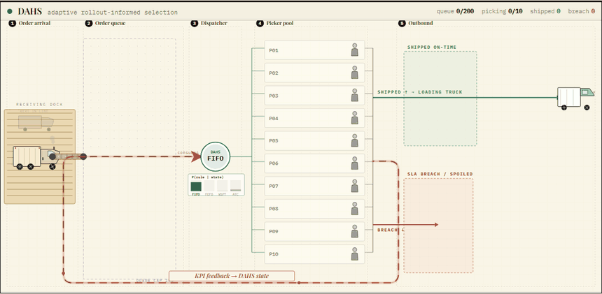

<div align="center">

# DAHS — Disruption-Aware Heuristic Scheduling

### Sample-Efficient Adaptive Heuristic Selection via Offline Rollout Distillation for Dynamic Warehouse Order Dispatching

**Vittal Mukunda** &nbsp;·&nbsp; **Atharva Somani** &nbsp;·&nbsp; **Pranjal Malaiya**

<sub>Department of Industrial Engineering and Management, R. V. College of Engineering, Bengaluru, India &nbsp;·&nbsp; 2026</sub>

<br/>

[](paper/manuscript.md)
[](pyproject.toml)
[](#4-the-dahs-method)
[-E8740C?style=flat-square)](REVISION_PLAN.md)

</div>

---

DAHS is a **selection hyper-heuristic** for dynamic warehouse order dispatching.
It picks, at every decision boundary of a shift, which simple dispatching rule
to apply — because no single rule is best across the operating conditions a shift
passes through. Short truncated-horizon stochastic rollouts of every candidate
rule are run *once, offline*, over a corpus of simulated shifts; the per-rule cost
vectors they produce become a supervised training signal for a calibrated
gradient-boosted ranker. An expensive online lookahead is thereby amortised into a
one-shot offline training set, and deploys as a single fast forward pass.

This construction is **not new**, and the paper does not claim it: it is rollout
classification policy iteration in the reinforcement-learning literature and
multi-pass rule selection in the scheduling literature. What the paper offers is a
controlled comparison of *training signals* — a directly measured per-rule cost
vector against a bootstrapped value and a policy gradient — at matched data
budgets, in a warehouse setting with two independent deadline clocks.

This repository contains the complete project: the discrete-interval warehouse
simulator, the full training pipeline, every competing baseline, the trained
model weights, all experiment results and manuscript figures, an interactive
dashboard, and the manuscript itself.

<div align="center">
<br/>



<sub><b>The interactive dashboard.</b> One 8-hour order-picking shift (seed 42),
replayed on the DAHS floor: orders arrive at the dock, queue, are dispatched
under the rule DAHS selects for each 15-minute interval, then ship on-time or
breach. Every frame comes from a real <code>simulation.warehouse_env</code> run
generated by <code>demo/build_run_log.py</code> — the browser only replays it,
nothing is fabricated. See <a href="#running-the-interactive-dashboard">Running
the Interactive Dashboard</a>.</sub>

</div>

---

## Status — results are being regenerated

This repository is mid-revision for **CAOR-D-26-01812**. Four reviewer-mandated
changes each alter the data-generating process or the objective, so **every
quantitative result in the submitted version has been withdrawn** and none is
reproduced here:

| Change | What it invalidates |
|---|---|
| Orders never served are charged rather than exempt (600x discount closed) | the primary metric, and every KPI |
| Customer due date and product expiry are separate constraints, both priced | the objective and the rule pool |
| Rollout labels are Monte Carlo means over independent continuations | every training label |
| The rule pool is recalibrated, expanded and screened | the action set |

Two simulator defects found in audit are also fixed: the objective ignored the
priority weights WSPT and ATC optimise, and the dispatcher reserved pickers for
orders that had not yet arrived, which structurally penalised arrival-agnostic
rules.

- **What to run:** [`RUN_CAMPAIGN.md`](RUN_CAMPAIGN.md) — the full recipe, roughly
  7 hours on 16 cores.
- **Why each change:** [`REVISION_PLAN.md`](REVISION_PLAN.md) — mapped to reviewer
  comments.
- **The paper:** [`paper/manuscript.md`](paper/manuscript.md). Passages awaiting
  the re-run are marked `TBD-rerun` and state what must be reported.

Stages 1–4 of the current-revision campaign are in `data/`, `runs/` and
`results/` (labels at $\tau=4$, $M=20$; ranker; static and lookahead evals).
Do **not** run `make clean-stale` on this tree — it would delete them. Remaining
work is FQI retrain (logger fix), default `snapshot_xgb` eval, Stage 4b/5, and
the items in `RUN_CAMPAIGN.md` §6. The test suite skips checks that need later
stage artifacts.

> The headline margin shrinks. Counting unserved-and-overdue orders as failures
> moves the advantage over FIFO from roughly 3.8x to 1.20x on this repository's own
> committed run logs. That is the correct number, and the revision is written
> around it.

## Contents

- [The paper](#the-paper)
- [Repository Layout](#repository-layout)
- [Installation](#installation)
- [Running the Interactive Dashboard](#running-the-interactive-dashboard)
- [Reproducing the Experiments](#reproducing-the-experiments)
- [One-Shot Setup Prompt for AI Agents](#one-shot-setup-prompt-for-ai-agents)

---

## The paper

The manuscript lives in **[`paper/manuscript.md`](paper/manuscript.md)** and is the
single source for it. It was previously duplicated in full into this README; that
copy was of the pre-revision draft and contradicted the current one on every point
the revision retracts, so it has been removed rather than re-synchronised.

`paper/dahs_ieee_paper.tex` and `.pdf` are the **pre-revision** IEEE-format build,
kept only for provenance. They do not reflect the corrections above and should not
be cited.

---

# Repository Layout

```
DAHS/
├── README.md                   # this file
├── pyproject.toml              # package metadata + pinned dependencies
├── Makefile                    # phase-by-phase experiment targets
├── config.yaml                 # central configuration (Hydra-loadable)
├── seed.py                     # central seed registry
├── logging_setup.py            # logging configuration
│
├── simulation/                 # discrete-interval warehouse simulator
│   ├── warehouse_env.py        #   environment / shift dynamics
│   ├── heuristics.py           #   FIFO, EDD, FEFO, WSPT, ATC, MS, MDD, COVERT
│   ├── orders.py               #   stochastic order generation
│   ├── state_extractor.py      #   25-dim decision-state features
│   ├── kpis.py                 #   KPI accounting
│   └── olist_arrivals.py       #   empirical bursty-arrival stream
│
├── labeling/                   # rollout / snapshot training-label generation
│   ├── snapshot_labeler.py
│   ├── soft_label_converter.py #   tempered-softmax label encoding
│   └── ambiguity_filter.py
│
├── regime/                     # GMM operating-regime discovery
│   └── regime_discovery.py
│
├── models/                     # the DAHS selector
│   ├── heuristic_ranker.py     #   calibrated gradient-boosted ranker
│   ├── calibration.py          #   isotonic probability calibration
│   └── switching_controller.py #   deployment-time guardrail
│
├── baselines/                  # competing controllers
│   ├── static.py               #   FIFO / FEFO / WSPT / ATC
│   ├── greedy_mpc.py           #   analytic one-step lookahead
│   ├── snapshot_xgb.py         #   tau=1 ablation ranker
│   ├── linucb.py               #   contextual bandit
│   ├── ppo_fair.py             #   PPO (matched / 60x budget)
│   └── offline_fqi.py          #   offline RL: fitted Q-iteration
│
├── experiments/                # experiment entry points (E1-E9, A, A2)
├── tests/                      # pytest suite
│
├── data/                       # training / test parquet datasets
├── runs/                        # trained model weights + per-run artifacts
│   ├── phase4/                 #   deployed DAHS model (tau=4)
│   ├── phase4_tau1..tau3/      #   rollout-horizon variants
│   ├── e3_hard_labels/         #   hard-label ablation model
│   ├── offline_fqi/            #   offline-RL baseline model
│   ├── ppo_fair/, ppo_full/    #   PPO baseline policies
│   └── data_efficiency/        #   sample-efficiency sweep (25-250 shifts)
├── results/                    # per-method evaluation parquets
├── figures/                    # manuscript figures (PNG + PDF)
│
├── paper/                      # manuscript
│   ├── manuscript.md           #   manuscript source
│   ├── dahs_ieee_paper.tex     #   IEEE-format source
│   ├── dahs_ieee_paper.pdf     #   compiled manuscript
│   └── references.bib          #   bibliography
│
└── demo/                       # interactive dashboard
    ├── index.html              #   dashboard entry point (no build step)
    ├── dahs-app/               #   React UI: run-log loader, floor, dashboard
    │   └── runs/               #   precomputed run logs (real WarehouseEnv)
    ├── dahs-demo.gif           #   README preview clip
    └── build_run_log.py        #   run-log generator (real WarehouseEnv)
```

---

# Installation

## Backend (Python)

Requires **Python 3.12**. `requirements-lock.txt` pins `scipy==1.18.0`, which
does not install on 3.10/3.11. `pyproject.toml` requires `>=3.12,<3.13`.

```bash
# 1. Create and activate a virtual environment
python -m venv .venv

# Windows (PowerShell):
.\.venv\Scripts\Activate.ps1
# macOS / Linux:
source .venv/bin/activate

# 2. Install the package and dev tools
python -m pip install --upgrade pip
pip install -r requirements-lock.txt
pip install -e . --no-deps

# 3. Import smoke test
python -c "import xgboost, sklearn, shap, stable_baselines3, omegaconf; print('ok')"

# 4. Run the test suite
python -m pytest -q
```

This installs the simulator, training pipeline, baselines, and dependencies
(numpy, pandas, scikit-learn, xgboost, shap, torch, stable-baselines3,
matplotlib, and others — see `pyproject.toml`).

## Running the Interactive Dashboard

The dashboard is a static React application (`demo/index.html` plus the
`demo/dahs-app/` directory) with no build step. It replays a real warehouse
shift — every order, dispatch decision, and DAHS rule switch is loaded from a
precomputed run log, so the browser only replays; it never simulates or
fabricates anything.

Serve the `demo/` directory over HTTP and open it in a browser:

```bash
cd demo
python -m http.server 5180
# open http://localhost:5180
```

Pick a baseline and press **Run simulation**. The run logs under
`demo/dahs-app/runs/` are produced by `demo/build_run_log.py`, which drives the
real `simulation.warehouse_env` under DAHS and the chosen baseline on one seeded
order stream. Seed 42 ships with the repository for every baseline; to add a
different seed, run the generator (the Python backend above must be installed):

```bash
python demo/build_run_log.py --seed 7 --baseline fefo
```

This writes `demo/dahs-app/runs/run_7_fefo.json`, which the dashboard loads when
you enter seed 7 on the setup screen.

## Reproducing the Experiments

The committed `data/`, `runs/`, `results/` trees hold **current-revision
Stages 1–4**. Do not run `make clean-stale` on this clone. Remaining compute is
in [`RUN_CAMPAIGN.md`](RUN_CAMPAIGN.md) §6 (`scripts/run_remaining.ps1` on
Windows). A fresh clone of *pre-revision* artifacts still needs `clean-stale`
before Stage 2.

The experiment entry points live in `experiments/`; the `Makefile` wraps them as
stage targets (run `make help` for the full list). Key targets:

The pipeline is five ordered stages. Stage 1 must precede Stage 2: it settles
the rule pool and the ATC/COVERT look-ahead scales that labelling consumes, and
`config.yaml` ships those scales as `null` so an uncalibrated run fails loudly
rather than silently reusing the submitted value.

| Target | Purpose |
|---|---|
| `make install` | Editable install with dev extras |
| `make gate` | Import smoke test |
| `make stage1` | Calibrate ATC/COVERT, screen the pool, state-space diversity, perishability diagnostic |
| `make stage2` | Label the corpus — the one expensive run |
| `make stage2-smoke` | 3 train + 2 test shifts, end-to-end check |
| `make stage3` | Regime layer, ranker, calibrator |
| `make stage4-teacher` | Rolling-horizon MPC — the distillation teacher |
| `make stage4-fqi` | Offline fitted-Q baseline: HP search + eval |
| `make stage4-rl-sensitivity` | PPO hyperparameter grid + offline action coverage |
| `make stage5-weights` | Objective-weight sensitivity |
| `make stage5-misspecification` | Label nominal, evaluate perturbed |
| `make e5-reliability` | Reliability diagrams + ECE/Brier |
| `make paper-figures` | Regenerate manuscript figures |
| `make test` | Run `pytest` |

Windows users without `make` can invoke the underlying module commands directly,
e.g. `python -m experiments.calibrate_rules screen` (see `Makefile` for each
target's exact command).

**Real-data experiments.** The Olist Brazilian e-commerce dataset is *not*
included in this repository. Only the real-data validation experiments
(`experiments/a_realdata_validation.py` and `experiments/a2_olist_arrivals.py`,
producing Figures 7 and 8) require it. To enable them, download the
[Brazilian E-Commerce Public Dataset by Olist](https://www.kaggle.com/datasets/olistbr/brazilian-ecommerce)
from Kaggle and unzip it into a folder named `Olist Dataset/` in the repository
root. All other code, model weights, results, and figures work without it.

---

# One-Shot Setup Prompt for AI Agents

If you are setting this project up with the help of an AI coding agent
(Antigravity, Claude Code, Cursor, and similar), paste the prompt below — the
entire block between the two `=====` lines — into the agent **after the repository
has been cloned**. It instructs the agent to set up the complete project — Python
backend and React frontend — in a single pass.

```text
=====================================================================
You are setting up the DAHS (Disruption-Aware Heuristic Scheduling) project on a
fresh machine. The repository is already cloned and is the current working
directory. Set up BOTH the Python backend and the React frontend so the project
runs end to end. Do not ask clarifying questions; make reasonable decisions and
report the outcome at the end.

First, detect the operating system. Use PowerShell syntax on Windows and bash
syntax on macOS/Linux for every command below.

STEP 1 — PYTHON BACKEND
- Check that Python 3.12 is installed: run `python --version`.
  The lockfile needs 3.12 (`scipy==1.18.0`). Do not use 3.13+.
- From the repository root, create a virtual environment: `python -m venv .venv`
- Activate it:
    Windows (PowerShell):  .\.venv\Scripts\Activate.ps1
    macOS / Linux:         source .venv/bin/activate
- Upgrade pip:             python -m pip install --upgrade pip
- Install from the lockfile (bit-reproducible), then the package with no extra
  deps:
                           pip install -r requirements-lock.txt
                           pip install -e . --no-deps
- Verify the install:
      python -c "import xgboost, sklearn, shap, stable_baselines3, omegaconf; print('backend ok')"
- Run the test suite as a smoke check:   python -m pytest -q

STEP 2 — INTERACTIVE DASHBOARD (static, no build)
- The dashboard is a static React app (demo/index.html + demo/dahs-app/). It has
  NO build step and NO JavaScript dependencies — do NOT install Node or run npm.
- It replays precomputed run logs from demo/dahs-app/runs/. Seed 42 ships with
  the repository for every baseline, so the dashboard works out of the box.
- NOTE: those shipped run logs are PRE-REVISION. They are fine as a visual demo
  of the simulator, but they are not current results and must not be quoted.

STEP 3 — RUN AND VERIFY END TO END
- Serve the demo/ directory over HTTP. Python's built-in server is enough:
      cd demo
      python -m http.server 5180
- Open http://localhost:5180 in a browser. The DAHS dashboard should load. Pick
  a baseline, press "Run simulation", and the floor animation should play.
- Optional — to add a run for a different seed, run the generator with the
  STEP 1 virtual environment activated, then reload the page and enter that seed:
      python demo/build_run_log.py --seed 7 --baseline fefo

STEP 4 — OPTIONAL: REAL-DATA EXPERIMENTS
- The Olist Brazilian e-commerce dataset is NOT included in the repository. Only
  the real-data validation experiments (experiments/a_realdata_validation.py and
  experiments/a2_olist_arrivals.py) need it. To enable them, download the
  "Brazilian E-Commerce Public Dataset by Olist" from
  https://www.kaggle.com/datasets/olistbr/brazilian-ecommerce and unzip it into a
  folder named "Olist Dataset/" in the repository root. Everything else — all
  code, the trained model weights under runs/, the results, the figures, and the
  dashboard — works without it.
- Stages 1–4 of the current revision are already in data/, runs/ and results/.
  Do not run `make clean-stale` unless those trees are still pre-revision.

FINAL REPORT
Report: the Python version used; whether `pip install -r requirements-lock.txt`
and `pip install -e . --no-deps` succeeded;
whether `python -m pytest -q` passed; and the dashboard URL
(http://localhost:5180). Note any step that failed and what you did about it.
=====================================================================
```
