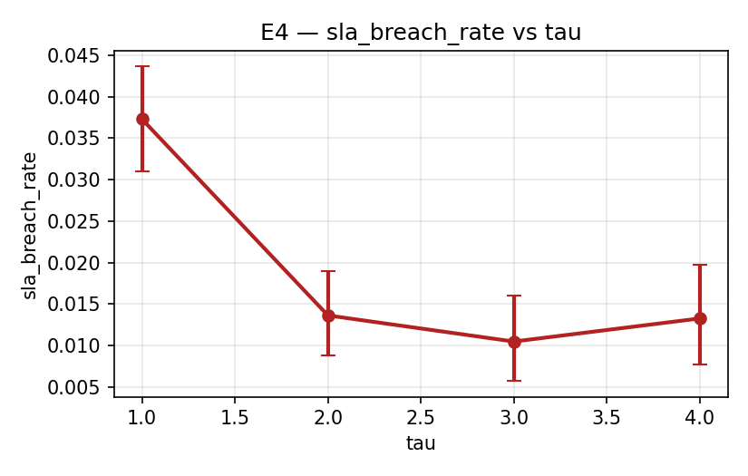
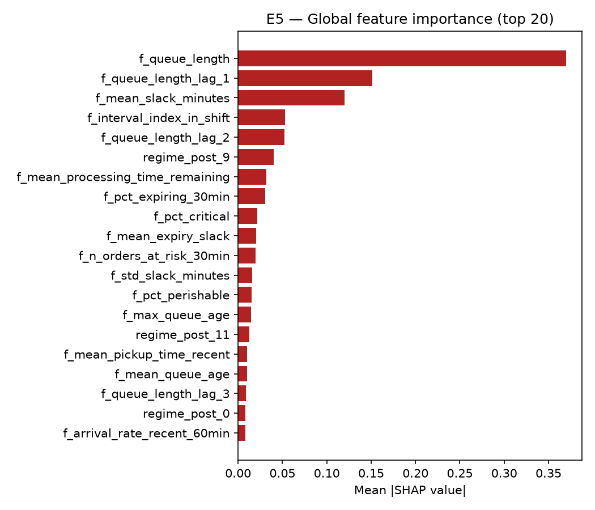

<!--
DRAFT v2 (2026-05-18). Reframed from the v1 "label distribution learning" framing
to "offline rollout distillation". The §6.8 hard-label ablation showed the soft-
vs-hard label choice is immaterial, so the contribution is the rollout-distillation
mechanism itself, not the distributional objective; the title, abstract, §1
contributions, §2, §4.3-4.4, §6.8, §7 and §9 were rewritten accordingly, and
former Limitation #5 (hard-label ablation not run) was removed because the
ablation has now been run and is reported in §6.8. Markdown draft; converts to
Elsevier elsarticle in Phase 9. All quantitative claims are drawn from the frozen
result files under results/ and figures/ (the ground truth); where prose
disagreed with a result file, the result file was used.

DRAFT v3 (2026-05-18). Added a published-competitor baseline: offline_fqi, an
offline reinforcement-learning selector (fitted Q-iteration with FEFO action
masking, the maskable-action-value family of Offline-LD). It trains on the same
logged shifts as DAHS; it is described in §5, added to Tables 1 and 2, evaluated
frozen across all four load scenarios and the twelve-cell robustness grid, and
analysed in the new §6.10. The abstract, §1, §2, §6.5, §7, §9 and Limitation #5
were updated, and references.bib gained the Ernst et al. (2005) fitted-Q citation.
New result files: results/offline_fqi.parquet, results/scenario_*/offline_fqi.parquet,
results/E9/, figures/E9/. No frozen Phase 0-7 result was re-run or re-tuned — this
only adds a baseline.
-->

> **Revision note on pending numbers.** Reviewers 1 and 2 identified four changes
> that each alter the data-generating process or the objective: the customer and
> product deadlines are now separate constraints and both enter the cost; orders
> never served are charged rather than exempt; rollout labels are Monte Carlo
> means over independent continuations rather than a single realised path; and the
> rule pool is recalibrated and rescreened. Every quantitative result in the paper
> is therefore regenerated. Passages awaiting the re-run are marked
> `⟨TBD-rerun⟩` and state explicitly what must be reported and, where the
> interpretation depends on the outcome, which way each conclusion falls. No
> number from the submitted version is carried forward into a claim.

# Abstract

Order dispatching in warehouses that face both customer due dates and product
expiry is routinely handled by simple priority rules, yet no single rule is best
across the operating conditions a shift passes through. A *selection
hyper-heuristic* — a controller that chooses which rule to apply as a function of
the current state — can in principle capture the envelope of a rule pool. Such
selectors are conventionally trained by simulating the candidate rules offline and
fitting a classifier to the result, a construction known as multi-pass rule
selection in the scheduling literature and as rollout classification policy
iteration in the reinforcement-learning literature. This paper does not propose a
new training mechanism. It asks instead what the *form of the supervision* is
worth, holding everything else fixed.

We formulate the problem as a sequential decision process: at each 15-minute
review epoch a controller observes a summary of the waiting queue and the picker
availability, and selects one dispatching rule to apply for that interval. Each
order carries two independent deadlines — a customer due date and, for perishable
goods, a product expiry — and both enter the cost, together with tardiness and
with orders left unserved at the end of the shift.

We then compare three ways of supervising the same selector, holding the
environment, the shift data, the model class, the observation and the objective
fixed, and varying only how the training signal is built. The first measures the
cost of *every* rule directly, by simulating each one forward for a few intervals
from each observed state and averaging over independently sampled futures. The
second learns a value function from the same logged transitions by fitted
Q-iteration. The third is a policy gradient. Only the first sees what the rules
it did not take would have cost; only it needs a simulator that can be reset and
re-run under a counterfactual action.

Two results bound the first signal's quality. Stopping a simulation after $\tau$
intervals rather than running it to the end of the shift introduces an error that
*shrinks* as $\tau$ grows. Simulating in a model that differs from the real system
by $\varepsilon$ per step introduces a second error that *grows* as
$O(\varepsilon \tau^2)$. The two together place the best horizon at roughly
$1/\varepsilon$: the more accurate the simulator, the further ahead it is worth
looking. We test that prediction by training in one parameterisation and
evaluating in another.

We report the comparison on held-out shifts, together with the computational cost
on both sides — how much simulation the offline training consumes, and how much
faster a decision becomes once the lookahead has been replaced by a single pass
through a fitted model.

⟨TBD-rerun: state the headline empirical findings here once the campaign
completes. Report the primary objective and the service-failure rate over all
arrived orders, not the breach rate over completed orders alone. Do not restate
the submitted margins: Section 6.2 shows the corrected accounting compresses
them substantially.⟩

**Keywords:** dynamic dispatching; selection hyper-heuristics; rollout;
approximate policy iteration; sequential decision processes; warehouse operations.

---

# 1. Introduction

Order dispatching on a warehouse floor is a sequential decision problem under
uncertainty: orders arrive stochastically, each carries a due date and possibly a
perishability constraint, and a small pool of pickers must be assigned work so as
to minimise late and spoiled orders. In practice the decision is delegated to a
*dispatching rule* — first-in-first-out, earliest-deadline-first, weighted
shortest-processing-time, and the like — because rules are transparent, fast, and
require no training. The well-known difficulty is that **no single rule dominates**:
the rule that minimises lateness under light load is not the rule that does so when
the queue is saturated or when a burst of perishable orders arrives. A controller
that *selects* the rule appropriate to the current state — a *selection
hyper-heuristic* [@drake2020hyperheuristics; @dokeroglu2024hyperheuristics] — can in
principle capture the envelope of the pool without abandoning the operational
advantages of rules.

The open question is how to *learn* the selector. The dominant modern answer is
deep reinforcement learning (DRL) [@mahmoudinazlou2025drl; @zhang2024lstmppo].
DRL is attractive but sample-hungry and notoriously unstable on problems where the
per-state advantage of one action over another is small relative to the return
variance — exactly the regime of rule selection, where every rule is a reasonable
policy and the differences are at the margin. A second answer is imitation
learning of an expert dispatcher [@hanjung2025imitation]. Both families face a
structural limitation: DRL never sees the counterfactual cost of the rules it did
*not* take, and imitation needs an expert demonstrator to imitate. The training
signal we use has neither problem — it measures the counterfactual cost of every
rule directly, and needs no expert.

The signal we study measures that cost directly. Fix a state, run each candidate
rule forward for a short horizon, and record the cost it incurs: this is a rollout
[@bertsekas2020rollout]. Rollouts can be run either way — online at each decision,
which is the classical control use and is too slow for a warehouse controller, or
offline once over a corpus of states, which is the construction used here and is
long established in both literatures this paper draws on (Section 2). For each
state in a corpus of simulated shifts we roll out every rule, obtain a per-rule
cost vector, and fit a supervised ranker to it. The expensive lookahead is thereby
*amortised* into a cheap function approximator: at deployment the ranker is a
single fast forward pass, and the rollouts live entirely in the training set. We
retain the cost *margin* between rules — not just which rule is best, but by how
much — through a soft, tempered-softmax label by default; an ablation (Section
6.8) shows the soft form is not essential.

This paper makes four contributions. None of them is the training mechanism, which
is not new: simulating a rule pool offline and fitting a classifier to the result
is rollout classification policy iteration in the reinforcement-learning
literature and multi-pass rule selection in the scheduling literature, and
Section 2 places the method inside both.

1. **A controlled comparison of training signals.** Holding the environment, the
   shift corpus, the function-approximator class, the feature set and the
   objective fixed, we vary only how the supervision is constructed: a directly
   measured per-rule cost vector, a bootstrapped state–action value fitted from
   the same logged transitions, and a policy gradient. Section 6.10 reports the
   comparison, with the action-coverage diagnostics that determine whether it is
   clean and the hyperparameter sensitivity analysis (Section 6.9) that
   distinguishes a structural result from a tuning artefact. This is the question
   the prior literature leaves open, and it is the paper's principal claim.
2. **Two bounds on the training signal, acting in opposite directions.**
   Proposition 1 bounds the error from truncating the rollout, which decays as
   $O(H-\tau)$. Proposition 2 bounds the error from rolling out under a
   *misspecified* model, which accumulates as $O(\varepsilon\tau^2)$. Together they
   imply an interior optimal horizon $\tau^\star \approx 1/\varepsilon$ — the
   better the simulator, the longer the rollout worth running — and that
   prediction is tested directly in Section 6.11 by labelling in one world and
   deploying in another. The submitted version had only the first bound and
   attributed the interior optimum to an estimator variance its implementation did
   not possess.
3. **A warehouse formulation with two deadline clocks.** Customer due date and
   product expiry are modelled as independent constraints, both entering the
   objective, and Section 3.5 *measures* whether the second binds at a 15-minute
   review interval rather than assuming it. We also state plainly that the
   controller observes a summary $\phi(S_t)$ rather than the state, exhibit two
   queues the summary cannot separate, and treat the problem as partially observed
   (Section 3.2).
4. **A sample-efficiency result.** Because each training state carries a directly
   measured per-rule target rather than a return, the selector saturates its
   learnable structure within a few dozen simulated shifts. We report the budget at
   which that happens and compare it against the offline-RL baseline given the same
   data.

## 1.1 Terminology and notation

The submitted version used a compact vocabulary without defining it, and terms
such as "corpus of simulated shifts", "held-out shifts", "SLA-breach rate" and
"snapshot-trained ranker" appeared unexplained. Every term used
in the paper is defined here, on first use in the text, or both.

| Term | Meaning |
|---|---|
| **shift** | One 8-hour working period, the unit of simulation. Divided into $N = 32$ review intervals of $L = 15$ minutes. |
| **decision epoch** | The boundary of a review interval, where the controller acts. There are $N$ per shift. |
| **dispatching rule** | A function that orders the waiting queue. Pickers are then assigned down that order. FIFO, EDD and the rest are dispatching rules. |
| **selection hyper-heuristic** | A controller that chooses *which dispatching rule to apply*, as a function of the current state, rather than choosing an assignment directly. |
| **corpus of simulated shifts** | A set of shifts generated from distinct random seeds, used as data. Split into three disjoint blocks: **training** (fits the selector), **calibration** (fits rule parameters such as ATC's look-ahead scale), and **test**. |
| **held-out shifts** | The test block. No held-out shift contributes to any fitting decision, including hyperparameter selection. |
| **SLA** | Service-level agreement — the contractual delivery commitment. An order's SLA due time $d_o$ is when it must ship. |
| **SLA-breach rate** | The fraction of orders shipped after $d_o$. Two denominators are possible and the choice matters (Section 3.3): over *arrived* orders, or over *completed* orders only. We always state which. |
| **service-failure rate** | Our primary reported KPI component: the fraction of *arrived* orders that either ship late or spoil, whether or not they were ever dispatched. |
| **rollout** | Simulating forward from a state under a fixed rule, to measure what that rule costs. |
| **truncated rollout** | A rollout stopped after $\tau$ intervals instead of running to the end of the shift. |
| **continuation** | One independently sampled future used for a rollout. The label averages over $M$ of them. |
| **ranker** | The fitted classifier that maps an observation to a distribution over rules. A gradient-boosted decision-tree ensemble here. |
| **snapshot-trained ranker** | The ranker fitted to labels from a *one-interval* rollout, i.e. $\tau = 1$. Used as an ablation to isolate the value of looking further ahead. |
| **soft label** | The training target expressed as a distribution over rules rather than a single winner, obtained from the cost vector by a tempered softmax. |
| **regime** | A cluster of operating conditions, discovered by a Gaussian mixture over training observations. Membership probabilities are appended to the observation. |
| **switching controller** | The deployment wrapper that enforces a minimum **dwell** (hold a rule for $T_{\min}$ epochs) and an **entropy gate** (permit an early switch when the ranker is confident). |
| **ablation** | Removing or altering one component and re-measuring, to establish what that component contributes. |
| **DAHS** | Disruption-Aware Heuristic Scheduling, the selection hyper-heuristic studied here. |

**Notation.**

| Symbol | Meaning |
|---|---|
| $t$, $N$, $L$, $T$ | epoch index; epochs per shift (32); interval length (15 min); shift length (480 min) |
| $S_t$ | the true state: queue with full per-order attributes, picker availability, clock |
| $\phi(\cdot)$, $x_t$ | the feature map, and the observation $x_t = \phi(S_t)$ the controller actually sees |
| $u_t$ | the decision at epoch $t$ — a rule from the pool |
| $W_{t+1}$ | exogenous information: orders arriving in $(t, t+1]$ and their attributes |
| $S^M(\cdot)$ | the transition function (Section 3.4) |
| $\mathcal{H}$, $h$ | the rule pool and a member of it |
| $H_t$ | intervals remaining in the shift at epoch $t$ (distinct from $\mathcal{H}$) |
| $a_o, p_o, d_o, x_o, w_o$ | order $o$'s arrival, processing time, customer deadline, product expiry, economic weight |
| $f_o$ | completion time of order $o$ |
| $J$; $W_b, W_t, W_s, W_h$ | the composite objective and its weights: breach, tardiness, spoilage, holding |
| $\tau$, $M$, $\beta$ | rollout horizon; continuations per rollout; softmax temperature |
| $\varepsilon$, $\bar{C}$ | per-step model error in total variation; upper bound on per-interval cost |

The remainder of the paper is organised as follows. Section 2 reviews related
work. Section 3 defines the dispatching problem and the simulator. Section 4
presents DAHS and the consistency result. Section 5 describes the experimental
protocol. Section 6 reports results. Sections 7–9 discuss, list limitations, and
conclude.

---

# 2. Related Work

## 2.1 Scope: which order-picking decision this paper addresses

Order picking decomposes into a set of interacting planning problems — storage
assignment, zoning, order batching, picker routing, and order release and
dispatching [@dekoster2007orderpicking; @vangils2018designing]. This paper
addresses **order release and dispatching only**: at a fixed review epoch, which
of the waiting orders are released to which picker, and in what order. Three
neighbouring problems are treated as exogenous and are held fixed throughout, and
because that restriction shapes every result we report, we state it explicitly
rather than leaving it to be inferred.

**Storage assignment and layout** are fixed. They are themselves substantial design
problems [@roodbergen2006layout], and they enter this model only through the
distribution of order processing times.

**Batching** is fixed at one order per pick tour. The controller never decides
which orders to combine; it decides only which order a free picker starts next.

**Routing and travel-time estimation** are exogenous. The processing time $p_o$
is a single realised service duration that aggregates travel, search and pick
time, in the three-point form standard when only time-standard data are available
[@tompkins2010facilities].

This restriction is deliberate for three reasons. First, it matches the planning
horizons of the decisions involved: layout, zoning and batching policy are
typically fixed over horizons far longer than a shift, so within-shift adaptive
control acts on dispatching alone [@vangils2018designing]. Second, rule selection
is only a well-posed question once the downstream problems are fixed; if the
action space also ranged over batch composition or route construction, the
comparison between dispatching rules would confound the rule with the batching
and routing policy it happens to be paired with. Third, travel-time estimation is
a substantial modelling problem in its own right, and embedding an estimator
inside the environment would make the rule comparison a comparison of travel
models. The cost of the restriction is real — DAHS cannot exploit batching or
routing synergies, and a controller that jointly optimised release and batching
could dominate it — and we record this in Section 8.

## 2.2 Dispatching rules and data-centric control in warehousing

Priority dispatching rules are the standard instrument for release decisions
under uncertainty: they are transparent, require no training, and execute in the
time available at a decision epoch. The classical families and their properties
are established [@conway1967theory; @pinedo2016scheduling] — arrival-driven
(FIFO), due-date-driven (EDD [@jackson1955edd], minimum slack, modified due date
[@baker1982mdd]), processing-time-driven (WSPT [@smith1956wspt]), and composite
slack-and-processing indices (COVERT [@carroll1965covert], ATC
[@vepsalainen1987atc]). The persistent finding across that literature is that no
single rule dominates: the rule minimising weighted tardiness under light load is
not the rule that does so once the queue saturates or the due-date mix tightens
[@pinedo2016scheduling].

In warehousing specifically, order release and dispatching under stochastic
arrivals has been surveyed by @dekoster2007orderpicking, @boysen2019warehousing
and @boysen2025warehousing, and the planning-problem taxonomy of
@vangils2018designing places dispatching among the operational decisions that
interact most strongly with due-date performance. The field's recent direction is
data-centric: @winkelhaus2020logistics4 survey the shift toward data-driven
warehouse control, and learned controllers have been applied to dynamic order
picking [@mahmoudinazlou2025drl], order batching [@cheng2024drlhyperheuristic],
and warehouse scheduling [@zhang2024lstmppo]. What distinguishes the warehouse
setting from the job-shop setting these methods were developed in is the presence
of a second deadline clock on perishable goods, which is the feature our problem
formulation makes explicit in Section 3.

## 2.3 Simulation-trained selectors of dispatching rules

Selecting a rule as a function of the shop state, with the selector trained on
simulation output, is a mature line of work and predates this paper by several
decades. @wu1988multipass introduced the *multi-pass* construction: at a decision
point, simulate the candidate rules forward, record their outcomes, and use the
result to choose. @mouelhi2010neural made the selector a learned function,
training a neural network on simulated states labelled by the best-performing
rule so that the multi-pass simulation is paid offline and the deployed decision
is a forward pass. @shiue2020rl extend the same construction with reinforcement
learning over the rule set. Surveys of dispatching-rule selection for dynamic
scheduling [@durasevic2022dispatching] and of hyper-heuristics generally
[@drake2020hyperheuristics; @dokeroglu2024hyperheuristics] organise this
literature around the offline-learning, online-application paradigm that the
present method also follows.

We correct a characterisation in the submitted version of this paper. We
previously wrote that prior selectors are "typically trained by genetic
programming, online reinforcement, or hard-label imitation". That is not accurate.
Genetic programming in this literature is used predominantly to *generate* the
low-level rules that are subsequently selected among, not to learn the selector
[@branke2016automated; @nguyen2017gpsurvey]; and prior selectors, including those
in @durasevic2022dispatching, @mouelhi2010neural and @shiue2020rl, are trained
essentially by supervised learning on simulation-derived labels — which is what we
do as well. The method in this paper belongs squarely inside that tradition
rather than departing from it.

## 2.4 Rollout and classification-based approximate policy iteration

A rollout policy improves a base policy by simulating each action at the current
state, following the base policy thereafter, and taking the action of least
simulated cost [@bertsekas2020rollout]. Rollouts are a cornerstone of approximate
dynamic programming [@simchilevi2021adp] and are typically truncated to a finite
horizon for tractability [@he2024truncatedrollout].

The construction we use — estimate action values by simulation at a sample of
states, then fit a classifier to represent the improved policy — is **Rollout
Classification Policy Iteration**, introduced by @lagoudakis2003rcpi and developed
by @fern2006api, @dimitrakakis2008rollout and @farahmand2015capi. It is not a new
training paradigm, and the submitted version of this paper was wrong to present it
as one. In particular, the claims that rollouts are "normally used online" and
that our method "inverts the usual deployment" were both incorrect: offline
rollout generation for supervised policy learning has existed for over two
decades in the reinforcement-learning literature and, as Section 2.3 records, for
longer than that in the scheduling literature. We withdraw those claims.

Two details of our instantiation differ from the standard RCPI setting, and we
note them as details rather than as contributions. The classifier is fitted to
the full per-action cost *vector* rather than to the arg-max alone, encoded as a
tempered-softmax label distribution [@geng2016ldl]; Section 6.8 reports an
ablation showing this makes no material difference, which is consistent with RCPI
practice. And the rollout is truncated at a short horizon with the truncation
error bounded explicitly (Proposition 1), which is a standard truncation argument
in the rollout tradition [@he2024truncatedrollout].

### Rollout and ADP for dynamic dispatching

The operations-research literature on dynamic dispatching under stochastic
arrivals is the closest methodological neighbour to this work, and the submitted
version did not engage with it. @klapp2018onedim and @klapp2018dispatchwaves
formulate the dispatch-waves problem — when to release accumulated demand, given
that more will arrive — which is structurally the decision studied here with
routing rather than rule selection as the inner problem. @goodson2017rolloutframework
give a general rollout framework for finite-horizon stochastic dynamic programs,
including the treatment of truncated horizons and pre- versus post-decision
rollouts that Proposition 1 sits inside; @goodson2016restocking apply
rollout policies to stochastic-demand routing.

@ulmer2020modeling set out the modelling conventions for stochastic dynamic
routing and dispatching problems that Section 3 follows, and the same group's work
on offline–online approximate dynamic programming [@ulmer2019offlineonline], on
budgeting decision time under stochastic requests [@ulmer2018budgeting], and on
anticipation against reactive re-optimisation [@ulmer2019anticipation] is directly
relevant to the trade-off this paper studies.

One thread deserves particular emphasis because it supersedes part of our
construction. That literature does not simply truncate a rollout and discard the
tail: it **approximates the remainder with a learned value function**, and in
places uses learning to set the rollout horizon state-dependently. Our
Propositions 1 and 2 treat truncation as a hard cut, which makes the truncation
bias $(H_t - \tau)\bar{C}$ a quantity to be tolerated rather than estimated. A
value-approximated tail would replace that term with an approximation error that
need not grow with the remaining horizon, which is strictly the better
construction and would likely permit a shorter $\tau$ — attractive here, because
Proposition 2 shows short horizons also limit model-error accumulation. We do not
implement it, and we record it in Section 9 as the most promising extension rather
than as an incidental idea.

### How this differs from value-function approximation

It is fair to ask what distinguishes this from value-function approximation or
reinforcement learning, since those also learn offline from simulation. The
submitted paper's answer was rhetorical. The substantive answer has three parts, and the first thing to say is that the method
is **inside** the approximate-dynamic-programming family, not outside it: what is
described here is one step of approximate policy iteration in which the improved
policy is represented by a classifier rather than derived from a value function
[@lagoudakis2003rcpi; @fern2006api].

*What is learned.* Value-function approximation fits $V(S)$ or $Q(S,u)$ — a
scalar satisfying, approximately, a Bellman fixed point — and recovers a policy
from it by one-step lookahead. Here no value function is ever formed and no fixed
point is sought. The object fitted is the policy itself: a classifier over
actions, trained on directly measured per-action costs at sampled states.

*How error behaves.* This is the difference that matters and it is why the
comparison in Section 6.10 is informative. A bootstrapped value estimate
propagates error through the Bellman backup, so an error at one state contaminates
its predecessors and the fixed point can be reached badly or not at all. The
classification construction has no backup: its error at each state is ordinary
supervised generalisation error, and errors at different states do not compound.
That is the mechanism our experiments are designed to isolate, holding the
environment, corpus, model class, feature set and objective fixed.

*What each requires.* This asymmetry runs against us and we state it plainly.
Value-function approximation can be fitted from logged transitions alone — the
data an operating warehouse already produces. The construction here needs a
simulator that can be **reset to an arbitrary state and rolled forward under a
counterfactual action**, because the label is the cost of rules that were not
taken. That is a strictly stronger requirement, it is the reason the method is
simulator-bound, and it is why the circularity of Section 8.1 is intrinsic rather
than incidental. A practitioner without a trustworthy simulator should prefer
value learning from logs; the comparison in this paper is only relevant to one who
has such a simulator and is deciding how to use it.

## 2.5 Reinforcement learning for dispatching

Deep reinforcement learning has been applied widely to dispatching and its
scalability for production scheduling is under active study
[@stockermann2025drlscalability; @tassel2023rljssp]. Two learning-based selectors
are the closest comparators and both appear as baselines here. Imitation learning
of dispatching decisions [@hanjung2025imitation] trains on the actions of a single
expert dispatcher, and so requires an expert; the multi-pass construction instead
measures the counterfactual cost of every rule and needs none. Offline
reinforcement learning with maskable action-value learning
[@pluijm2025offlineld] learns a value function from logged data, and is
reimplemented faithfully in Section 5 as a fitted-Q baseline
[@ernst2005fqi] trained on the same logged shifts. We also include Proximal
Policy Optimization [@schulman2017ppo] under a matched simulation budget and,
separately, at a 60× budget, with a hyperparameter sensitivity analysis in
Section 6.9. A recent review [@sauer2025mlscheduling] frames simulation-derived
self-labelling as an emerging paradigm for machine learning in scheduling.

## 2.6 Positioning and what this paper contributes

Given Sections 2.3 and 2.4, the mechanism at the centre of this paper is not
novel, and we do not claim it. Simulating a rule pool offline and fitting a
classifier to the result is RCPI in the reinforcement-learning literature and
multi-pass rule selection in the scheduling literature. What we offer instead is
an **empirical study**, with three components.

1. **A controlled comparison of training signals at matched data budgets.** The
   question we can answer, and which the prior literature has not answered
   directly, is what the *supervision* buys. We hold the environment, the shift
   corpus, the function-approximator class and the objective fixed, and vary only
   how the training signal is constructed: a directly measured per-action cost
   vector, a bootstrapped state-action value fitted from the same logged
   transitions, and a policy gradient. Section 6.10 reports that comparison, and
   Section 6.9 supports it with the hyperparameter sensitivity analysis needed to
   distinguish a structural result from a tuning artefact.

2. **A warehouse instantiation with two deadline clocks.** We model the customer
   due date and the product expiry as independent constraints, both entering the
   objective, and we measure whether the second one binds at a 15-minute review
   interval rather than assuming it (Section 3.5). This is the feature that
   distinguishes perishable-goods warehousing from the job-shop settings the
   dispatching-selection literature was developed in.

3. **A sample-efficiency result.** Because each training state carries a directly
   measured per-action target rather than a return, the selector saturates its
   learnable structure within a few dozen simulated shifts. We report the budget
   at which that happens and compare it against the offline-RL baseline given the
   same data.

We make no claim to a new training paradigm, and the contribution should be read
as the application and the controlled comparison, not the mechanism.

---

# 3. Problem Setting and Simulator

## 3.1 Orders, and the two deadline clocks

We consider a single warehouse shift of length $T$ (8 hours). Orders arrive over
the shift. Order $o$ carries

| symbol | meaning |
|---|---|
| $a_o$ | arrival time |
| $p_o$ | processing time — one pick tour, aggregating travel, search and pick (Section 2.1) |
| $d_o$ | **customer deadline**: the absolute time by which the order must ship |
| $x_o$ | **product deadline**: the absolute time after which the goods are no longer saleable. Finite for perishable orders, $x_o = \infty$ otherwise |
| $w_o$ | economic weight of the order, set by its priority class |

The two deadlines are distinct constraints with distinct failure modes, and they
are sampled independently: missing $d_o$ ships an order late, missing $x_o$
destroys the goods. Either can bind first. This is the substantive change from
the submitted version of this paper, in which orders carried only $d_o$, the rule
we called FEFO in fact sorted on $d_o$, and "spoilage" was defined as a perishable
order missing its *due date* — so perishability was a label on an order rather
than a constraint on the problem. The model, the objective and the rule pool are
corrected accordingly, and Section 3.5 tests whether the corrected constraint
actually binds.

**Where the expiry of an order comes from**. FEFO is conventionally a rule for
issuing inventory *lots*, not customer orders, so an order-level expiry requires
justification. We model the stage *after* lot allocation: an upstream allocation
policy — exogenous here, in the same sense as routing and batching (Section 2.1) —
has already committed specific lots to specific orders, so each order inherits a
concrete expiry from the stock reserved against it. For a single-line order that
is the allocated lot's expiry. For a multi-line order, the order ships as a unit
and is therefore constrained by its most perishable component, so
$x_o = \min_{\ell \in o} x_\ell$ over the allocated lines $\ell$. The experiments
in this paper use single-line orders, so $x_o$ is the allocated lot's expiry
directly; the minimum-over-lines rule is the generalisation and requires no change
to the controller, since the controller reads only $x_o$.

A fixed set of $m = 10$ pickers processes orders; a picker handles one order at a
time and is busy for its processing time. Decisions are taken at the boundaries of
$N = 32$ equal review intervals of $L = 15$ minutes. At each boundary the
controller observes the system and chooses a *dispatching rule* from a fixed pool;
that rule ranks the waiting queue, and pickers are assigned down the ranking.

## 3.2 The decision process, and what the controller can see

The submitted version of this paper described the problem in prose and moved
directly to the implementation, so it never established what decision was being
taken, against what information, or under what objective. This section is the
remedy. We state the problem as a
**sequential decision process** in the canonical form of @powell2019unified and
@powell2022rlso — state, decision, exogenous information, transition function,
objective — before any implementation detail, and Section 3.4 then specifies the
transition concretely. Readers who prefer the reinforcement-learning vocabulary
may read the five elements as a finite-horizon Markov decision process; the
partial-observability caveat below applies under either reading.

**The sequential decision process**. Decisions are taken at epochs
$t = 0, 1, \dots, N-1$, one per review interval. The **state** is

$$ S_t \;=\; \big(\, \mathcal{Q}_t,\; \mathbf{b}_t,\; t \,\big), $$

where $\mathcal{Q}_t$ is the multiset of waiting orders, *each carrying its full
attribute tuple* $(a_o, p_o, d_o, x_o, w_o)$, and
$\mathbf{b}_t \in \mathbb{R}^m$ records when each picker next becomes free. The
**decision** is $u_t \in \mathcal{H}$, a rule from the pool. The **exogenous
information** $W_{t+1}$ is the set of orders arriving in $(t, t+1]$ with their
attributes. The **transition** $S_{t+1} = S^M(S_t, u_t, W_{t+1})$ is the
admission–rank–assign procedure of Section 3.4. Writing $C(S_t, u_t, W_{t+1})$
for the cost accrued over the interval (Section 3.3), the problem is

$$ \min_{\pi \in \Pi} \; \mathbb{E}\left[\; \sum_{t=0}^{N-1} C\big(S_t,\, U^\pi_t(S_t),\, W_{t+1}\big) \;\right] . $$

**The observation is not the state**. The controller does not see $S_t$. It sees

$$ x_t \;=\; \phi(S_t) \;\in\; \mathbb{R}^{26}, $$

a fixed-length summary listed in Appendix A. The submitted version of this paper
called $x_t$ "the state". That is wrong as terminology and, more importantly, as
mechanism: $\phi$ records *marginal*
summaries — queue length, mean and standard deviation of slack, mean processing
time, counts of critical and perishable orders — and discards the *joint*
distribution over per-order attributes. But it is the joint distribution that
determines what a ranking rule does next, because a rule orders orders by a
function of their attributes taken together.

**A witness**. $\phi$ is not injective on the reachable state space, and the
failure is not exotic. Consider two queues of two orders each, arriving at the
same instant, differing only in which order carries the tight deadline:

$$ \mathcal{Q}^{A} = \{(p_{\text{short}}, s_{\text{loose}}),\, (p_{\text{long}}, s_{\text{tight}})\}, \qquad \mathcal{Q}^{B} = \{(p_{\text{short}}, s_{\text{tight}}),\, (p_{\text{long}}, s_{\text{loose}})\}, $$

writing $s_o = d_o - t - p_o$ for slack. The two have the same queue length, the
same arrival times and therefore the same ages, the same mean and standard
deviation of slack, the same mean processing time, and — with $s$ and $p$ chosen
so that the critical thresholds fall the same way — the same critical and at-risk
counts. Every coordinate of $\phi$ agrees: $\phi(S^A) = \phi(S^B)$ exactly. The
dynamics do not agree. In $\mathcal{Q}^{A}$ the binding deadline sits on the order
that occupies a picker longest, so deferring it is expensive and the feasible set
of on-time completions is strictly smaller than in $\mathcal{Q}^{B}$.

Two conditions are needed for that difference to be *realised*, and both are part
of the construction rather than incidental to it.

*The queue must contend for a picker.* A ranking expresses a preference only when
something has to wait. With the deployed ten pickers and a two-order queue both
orders start immediately whatever the ranking says, every rule produces the
identical trajectory, and the cost gap is zero by construction. The witness is
therefore built at one picker. This is not a weakening: contention is the regime
in which rule selection has any effect at all, so it is the only regime in which
partial observability can cost anything.

*The rule must key on slack and processing time jointly.* Queues $\mathcal{Q}^A$
and $\mathcal{Q}^B$ carry the *same multiset* of slacks, so a rule that sorts on
slack alone — EDD, EEDD, MS, MDD — orders them identically and no witness exists
under it. The composite rules ATC and COVERT rank on slack *and* $p_o$ together,
which is precisely the interaction $\phi$ discards by recording the two marginals
separately. That is the sharper statement of the defect: $\phi$ retains the
marginal distributions of slack and of processing time and destroys their
coupling.

`experiments/observability_analysis.py` searches a grid of picker counts,
processing times and slacks over every rule in the pool, verifies that the feature
vectors coincide to machine precision before comparing anything, and reports the
strongest gap. Under ATC at $\tau = 4$ with one picker it finds
$\phi(S^A) = \phi(S^B)$ to machine precision with costs of $3.79$ against
$-0.01$ — a gap of $3.80$, against a per-order breach weight of $W_b = 3.0$. One
such pair is sufficient: $\phi$ is not a sufficient statistic, and no quantity of
training data recovers from $\phi$ what $\phi$ does not contain.

**Consequence: a POMDP, and a policy-function approximation**. We therefore do not
claim that $\phi$ is a sufficient statistic — it is not, and the witness settles
it. The control problem is a **partially observed** Markov decision process, and
the policy class we search is a policy-function approximation over the
observation,

$$ U^\pi(S_t) \;=\; \arg\max_{h \in \mathcal{H}} \; f_\theta\big(\phi(S_t)\big)_h , $$

with no belief state maintained and no history beyond the lags $\phi$ carries
explicitly. Two consequences follow, and they pull in different directions.

The unfavourable one is that there is an **irreducible regret floor**: two states
that $\phi$ cannot separate must receive the same action, so whenever their
optimal actions differ, some regret is incurred that no amount of data or model
capacity can remove. We measure this rather than assume it away. Over the
training corpus we locate mutual near-neighbours in standardised $\phi$-space and
report how often they disagree about the cost-minimising rule, and what acting on
the neighbour's choice costs, as a share of the total benefit available from rule
selection. That number is an upper bound on the part of the residual regret
attributable to partial observability, and it is reported in Section 8 alongside
the other limitations rather than buried.

The favourable one is more specific than it first appears. The rollout **labels**
are computed from the true state $S_t$: the simulator holds $\mathcal{Q}_t$ in
full, and the rollouts of Section 4.3 run the actual dynamics from it. So the
supervision target is *correct*; it is only the *covariates* that are lossy. The
learning problem is therefore regression with insufficient covariates — a Bayes
risk induced by the feature map — and not a misspecified or biased target. This
distinction matters for interpreting the results: a residual gap between DAHS and
a controller with access to $S_t$ is attributable to $\phi$, not to the training
signal, and enlarging $\phi$ (a set encoding over queued orders, for instance) is
the remedy. We leave that to future work and record it in Section 9.

## 3.3 The objective

Let $f_o$ denote the completion time of order $o$ if it is dispatched. For an
order still waiting at the reference horizon $T$ we set $f_o = T + p_o$: the
earliest it could possibly finish, since it still requires a full pick. With that
convention every order that arrived has a well-defined outcome whether or not it
was ever served, and

$$ J \;=\; \sum_{o \in \mathcal{A}} w_o \Big[\, W_{b}\,\mathbb{1}\{f_o > d_o\} \;+\; W_{t}\,\max(f_o - d_o,\,0) \;+\; W_{s}\,\mathbb{1}\{f_o > x_o\} \,\Big] \;+\; W_{h}\,|Q_T| , $$

where $\mathcal{A}$ is the set of orders that arrived during the shift and
$|Q_T|$ is the queue length at shift end. Weights are
$W_{b} = 3.0$ (late shipment), $W_{t} = 0.2$ per minute of lateness,
$W_{s} = 5.0$ (spoilage), and $W_{h} = 0.005$ per queued order. They are fixed
before any learning and are not tuned to any method.

Three features of this objective differ from the submitted version, and each is
consequential.

**Priority class now enters the objective**. WSPT and ATC have always ranked by
$w_o/p_o$, but the submitted objective weighted every order equally. Those rules
were therefore optimising a criterion the evaluation never measured, which is a
substantial part of why their reported performance looked anomalous (Section 6.2).
Rule and objective now agree.

**Perishability now enters the objective**. The $W_s$ term is the only place a
product deadline can be priced. Without it, "perishability-constrained" was not a
property of the optimisation problem at all.

**Orders that are never served are charged**. In the submitted objective an order
abandoned in the queue attracted only $W_{h} = 0.005$, against $W_{b} = 3.0$ for
one served late — a factor of 600. A controller could therefore lower its reported
breach rate by declining to touch difficult orders, and the reported breach rate
was computed over *completed* orders only, so those orders left the metric
entirely. The convention $f_o = T + p_o$ closes both gaps: an unserved order past
its deadline is charged exactly as a late one, and the $+\,p_o$ ensures that
dispatching an order onto a free picker costs precisely what abandoning it costs,
with any earlier dispatch costing strictly less. Doing the work is therefore
weakly optimal by construction, which the submitted objective did not guarantee.
$W_h$ survives strictly as a work-in-progress holding cost. Section 6.2 reports
both the corrected metric and the submitted one, so the two are comparable.

**Spoilage mechanics, stated explicitly**. The submitted version left four
questions unanswered, and each is answered here rather than left to be inferred
from the code.

*Does a perishable order have a distinct expiry, or is it the due date?* Distinct.
$x_o$ is drawn independently of $d_o$ (Section 3.1), so for a perishable order
either clock can bind first. In the submitted model there was no $x_o$ at all and
"spoilage" was defined as a perishable order missing $d_o$, which made the two
events the same event by construction.

*What happens when an order spoils?* Its goods become unsaleable at $x_o$, and the
charge $W_s w_o$ is incurred at that instant and is permanent — picking the order
afterwards does not undo it. The order is **not** removed from the queue: spoiled
stock still has to be pulled and disposed of, so it continues to consume a picker
when it is eventually handled. Keeping it in the queue also closes an incentive
gap. If spoiled orders vanished, a controller could free picking capacity by
stalling until perishables expired, which is the same class of loophole as
exempting unfinished orders.

*Is a spoiled order counted in the breach count?* Lateness and spoilage are
**separate predicates** on the same order, and an order may be neither, either, or
both. When both fire, the composite cost charges both — they are distinct
economic losses, a late shipment and destroyed stock. In the reported metrics they
are kept apart so nothing is double-counted in a headline: the breach rate counts
lateness only, the spoilage rate counts spoilage only, and the primary
**service-failure rate** counts an order once if it is late *or* spoiled.

*How are unfinished perishables penalised at shift end?* Through the same
$f_o = T + p_o$ convention as any other unserved order (above). If
$T + p_o > x_o$ the order is spoiled and charged $W_s w_o$; if $T + p_o > d_o$ it
is also late and charged $W_b w_o$ plus tardiness. Since shelf life is at most 120
minutes against a 480-minute shift, a perishable order still waiting at shift end
is spoiled with near certainty, which is the intended behaviour: abandoning
perishable stock is the most expensive thing this objective can do.

**How the reported rates are calculated**. Writing $\mathcal{A}$ for the set of
orders that arrived during the shift, $\mathcal{S} \subseteq \mathcal{A}$ for
those dispatched, and $\mathcal{P} \subseteq \mathcal{A}$ for the perishable ones:

$$ \text{service-failure rate} = \frac{|\{o \in \mathcal{A} : f_o > d_o \ \text{ or } \ f_o > x_o\}|}{|\mathcal{A}|}, \qquad \text{spoilage rate} = \frac{|\{o \in \mathcal{P} : f_o > x_o\}|}{|\mathcal{P}|}, $$

$$ \text{breach rate}_{\text{arrived}} = \frac{|\{o \in \mathcal{A} : f_o > d_o\}|}{|\mathcal{A}|}, \qquad \text{breach rate}_{\text{served}} = \frac{|\{o \in \mathcal{S} : f_o > d_o\}|}{|\mathcal{S}|} . $$

The last of these is the metric the submitted paper reported, under the
unqualified name "SLA-breach rate". Its denominator excludes every order the
controller declined to dispatch, and — with $W_h = 0.005$ against $W_b = 3.0$ —
so did the objective. Both are reported here, under names that make the
denominator explicit, so the two versions of the paper remain comparable.
$\mathcal{A}$ includes orders rejected at the door when the queue was at
capacity; they are real demand that went unmet, and excluding them would reopen
the same gap in a different place.

## 3.4 The simulator and its parameters

The transition function $S^M$ of Section 3.2 is realised as a discrete-interval
simulation model; its construction, verification and validation follow standard
practice [@law2000simulation; @sargent2013vandv], with the input distributions
fitted to a public order trace where one exists (Section 6.7) and the remaining
parameters carrying explicit provenance tags below.

The environment is a periodic-review discrete-interval model. Within interval
$[t, t+L)$ it (i) admits every order that has arrived **by $t$**, subject to a
queue capacity of 200, recording overflow as *rejected demand* rather than
discarding it; (ii) ranks the waiting queue with the chosen rule, evaluated at
$t$; (iii) assigns down the ranking to the earliest-free picker with start time
$\max(\text{picker free}, t)$, stopping once no picker can start before $t+L$;
and (iv) records end-of-interval statistics. Orders arriving inside the interval
wait for the next epoch.

The admission rule matters. The submitted simulator admitted every order arriving
before $t+L$ — fifteen minutes of look-ahead — and set the start time to
$\max(\text{picker free}, a_o, t)$, so ranking a not-yet-arrived order *reserved a
picker and left it idle* until that order appeared. Rules sorted by arrival never
paid this cost; arrival-agnostic rules paid it constantly. Section 6.2 shows this
was the second cause of the anomalous rule performance reported there.

**Parameters and their provenance**. Every input is now either fitted to data,
grounded in a cited source, or declared a design choice; none is left unexplained.

| Input | Value | Provenance |
|---|---|---|
| Shift, review interval, pickers | 8 h, 15 min, 10 | Operating point |
| Queue capacity | 200 orders | Operating point |
| Inter-arrival **shape** | Empirical bootstrap of the Olist trace | **Fitted** (Section 6.7) |
| Arrival **rate** | 1.65 orders/min nominal | Operating point; swept in Section 6.5 |
| Processing time $p_o$ | Triangular$(2, 5, 12)$ min | **Literature**: three-point time standard for manual picker-to-parts picking [@tompkins2010facilities; @dekoster2007orderpicking] |
| Customer window $d_o - a_o$ | Triangular$(15, 45, 90)$ min | **Fitted** to the Olist purchase-to-estimated-delivery distribution, shape only, rescaled to the shift time base |
| Shelf life $x_o - a_o$ | Triangular$(20, 60, 120)$ min | Design parameter; no public trace carries expiry. Swept in Section 6.4 |
| Perishable fraction | 0.20 | Design parameter; varied by scenario |
| Priority classes and weights | $\{$low, medium, high$\}$ at $(0.50, 0.35, 0.15)$, $w_o \in \{1, 2, 4\}$ | Design parameter |

This inverts the submitted workflow, in which parameters were set and then
*validated* against a public trace. Fitting is the right operation on a trace that
exists, and Section 6.7 now reports the fits, the candidate
families compared by AIC, and — for processing time, where the trace carries no
warehouse pick-time field — the reason no fit is attempted.

## 3.5 Does perishability bind at a 15-minute horizon?

A model can carry a product deadline without that deadline ever changing a
decision. Since we claim the setting is perishability-constrained, we test the
claim directly rather than assert it. The criterion is decision-relevance: in what
fraction of decisions does delaying an order by one review interval alter its
outcome?

At each epoch $t$, a waiting order has exactly two options available to the
dispatcher — served now, completing at $t + p_o$, or deferred, completing no
earlier than $t + L + p_o$. Call the order **expiry-pivotal** at $t$ when those
two straddle its product deadline,

$$ t + p_o \;\le\; x_o \;<\; t + L + p_o , $$

so that one interval of delay is the difference between saleable goods and waste,
and **due-pivotal** when the same holds for $d_o$.

Three conditions were fixed *before* the diagnostic was run, and all three had to
hold for the framing to stand: at least 5% of decisions carrying an expiry-pivotal
order; at least 10% of perishables having their product clock bind before their
customer clock; and the choice of rule moving the spoilage count at at least 10% of
epochs. Had any failed, the correct response was to drop the perishability framing
and the expiry-aware rules, and to report that instead.

**Table 1**. Perishability decision-relevance, 30 calibration shifts, 7,440
decision epochs.

| Quantity | Measured | Threshold |
|---|---:|---:|
| Decisions with an expiry-pivotal order in queue | **35.5%** | ≥ 5% |
| Perishables whose expiry binds before their due date | **27.6%** | ≥ 10% |
| Epochs where the rule choice changes the spoilage count | **91.0%** | ≥ 10% |
| Queued perishables that are expiry-pivotal | 7.3% | — |
| All orders that are expiry-pivotal | 1.4% | — |
| Share of economic weight on expiry-pivotal orders | 1.3% | — |
| Mean spoilage spread across rules, when discriminating | 3.97 orders | — |

All three pre-registered conditions are met, so the constraint is real at this
horizon and the framing stands. Two qualifications belong with that conclusion
rather than after it. The *marginal* rate is small — only 1.4% of individual orders
are expiry-pivotal at any given epoch, carrying 1.3% of economic weight — so
perishability is not the dominant cost driver; the customer clock is, with 95.1% of
epochs carrying a due-pivotal order against 35.5% carrying an expiry-pivotal one.
What makes it decision-relevant is concentration and frequency: the pivotal orders
cluster, so a third of all decisions have at least one in the queue, and at 91.0% of
epochs the choice of rule moves realised spoilage — by about four orders where it
moves it at all. A constraint that changes the outcome at nine epochs in ten is
binding on the controller whatever share of orders it touches.

## 3.6 The rule pool

The pool is not a convenience sample. Candidates span the four information
sources a dispatcher can key on, so that "no single rule dominates" is a
structural property of the design space rather than an empirical accident. Nine
candidates are screened (Section 6.1); the six that survive are marked.

| Rule | Keys on | Source | Retained |
|---|---|---|:--:|
| FIFO | arrival only | zero-information control | — |
| EDD | customer deadline | @jackson1955edd | ✓ |
| **EEDD** | **both deadlines**: $\min(d_o, x_o)$ | this paper (see below) | ✓ |
| MS | customer deadline slack | @conway1967theory | ✓ |
| MDD | customer deadline, degrading to SPT when past due | @baker1982mdd | ✓ |
| FEFO | product deadline only | classical lot-issuing rule | — |
| WSPT | weight and processing time | @smith1956wspt | — |
| ATC | slack × processing, exponential discount | @vepsalainen1987atc | ✓ |
| COVERT | slack × processing, linear truncation | @carroll1965covert | ✓ |

Four points the submitted version left open.

**FEFO is not a due-date rule, and neither rule alone is right**. The submitted
paper described FEFO as "deadline-aware" and implemented it as a sort on $d_o$.
That is EDD, and both now appear under their correct names. But separating them
exposed something the submitted model could not have shown: with two deadlines,
*neither* single-clock rule is the sensible one. EDD ignores expiry entirely.
FEFO ranks on $x_o$, which is $\infty$ for the 80% of orders that are not
perishable, so it dumps every non-perishable order behind every perishable one —
on this order mix that is close to a strawman, and it is why the FEFO mask
(Section 4.3) had to exist at all.

The rule a scheduler would actually write, told that orders carry two deadlines,
sorts ascending on the **effective deadline** $\min(d_o, x_o)$ — whichever clock
binds first. We call it **EEDD**, and it is in the pool because leaving it out
would have made "expiry-awareness buys nothing" an artefact of testing only a
degenerate expiry rule. Section 6.1 reports what it earns.

**ATC is calibrated, not assumed**. WSPT is exactly the $k \to \infty$ limit of
ATC: as the look-ahead scale grows, $\exp(-\text{slack}/(k\bar p)) \to 1$, leaving
the WSPT index $w_o/p_o$. A correctly calibrated ATC therefore cannot be beaten by
WSPT, and the submitted result — WSPT winning 32% of decisions against ATC's 10% —
was a symptom of an unfitted $k$, fixed at 2.0 with no search performed. We
calibrate $k$ twice, on a calibration corpus disjoint from both training and test
shifts: once for **standalone** use, because ATC is itself a reported benchmark
and benchmarking an uncalibrated rule understates it; and once for **portfolio
contribution**, which is the quantity that matters when the rule sits inside a
selector. COVERT's scale is calibrated the same way. Section 6.1 reports both
values and the deployed one.

**Screening is by marginal contribution, not win rate**. A rule earns its slot by
covering states the others handle badly. We therefore report, per rule, both its
win rate and the increase in achievable cost if it were removed from the pool,
with a bootstrap interval on the latter. A rule with a high win rate and zero
marginal contribution is redundant; a rule with a low win rate and positive
marginal contribution is a specialist worth keeping. Win rate alone, which is what
the submitted Section 6.1 reported, cannot distinguish the two. This is also how
we answer what **FIFO** contributes in a due-date-driven setting: it enters as the
zero-information control and the screen reports whether it earns its place.

---

# 4. The DAHS Method

## 4.1 Overview

DAHS is an offline-learned, online-applied selection hyper-heuristic. Training
proceeds in four stages: (1) generate a corpus of simulated shifts under a
state-covering behaviour policy; (2) for every decision state, run a
truncated-horizon rollout of each rule and record the per-rule cost vector, from
which a training label is formed; (3) discover a small set of operating *regimes*
and append regime-membership features; (4) fit a calibrated gradient-boosted
ranker to the rollout-derived labels. At deployment a lightweight *switching
controller* wraps the ranker to enforce a perishability constraint and to bound
rule-switching frequency. We describe each stage in turn.

## 4.2 The observation vector

At each decision epoch the controller receives $\phi(S_t)$, a 26-dimensional
summary of the true state (Section 3.2) covering queue, resource, customer-
deadline, product-deadline, arrival, history and temporal context. It is an
observation, not a state, and Section 3.2 gives the explicit pair of queues it
cannot separate. Appendix A lists every feature with its group and the source or
design rationale it derives from — the submitted version listed the features
without saying where they came from or whether they had been screened.

Two features of the submitted set are removed. `time_to_next_expected_carrier` was
$1/\lambda$ and therefore **constant** within a configuration; `intervals_remaining`
was an exact affine function of `interval_index_in_shift`, the two summing to $N$
by construction. Together they made the feature matrix exactly singular, which
silently corrupted the regime layer's model selection (Section 4.5). Three
expiry-pressure features are added, since the product deadline now enters the
objective and a selector cannot act on a constraint it cannot see. Appendix A also
reports the correlation and variance-inflation analysis that identified the
redundancies, and Section 6.8 ablates down to the five most important features to
test whether the full set earns its dimensionality.

To $\phi(S_t)$ DAHS appends the regime-membership posteriors of Section 4.5.

## 4.3 Rollout-informed training labels

The supervisory signal is generated as follows. We simulate a corpus of training
shifts under a state-covering behaviour policy, giving one decision state per
review epoch per shift. For each state $s_t$ we form a label over the pool by
**multi-sample truncated rollout**:

1. Walk the shift forward to epoch $t$, so that $s_t$ is the true state $S_t$ with
   its full queue.
2. Draw $M$ independent continuations. Continuation $m$ freezes the realised
   history at $t$ and resamples the *unrealised* future — arrivals after $t$ and
   their attributes — from a stream seeded by $(\text{shift}, t, m)$.
3. For each rule $h$, commit to $h$ at $t$, apply the base policy for the next
   $\tau$ epochs of continuation $m$, and record the cost
   $\hat{J}^{\tau}_{h,m}(s_t)$ accrued over that window. Average:
   $$ \hat{J}^{\tau}_h(s_t) \;=\; \frac{1}{M}\sum_{m=1}^{M} \hat{J}^{\tau}_{h,m}(s_t), \qquad \widehat{\mathrm{se}}_h(s_t) \;=\; \frac{\hat{\sigma}_h(s_t)}{\sqrt{M}} . $$
4. Convert the cost vector into a probability distribution by a **tempered
   softmax** at a state-dependent temperature:
   $$ p^{\tau}_h(s_t) = \frac{\exp(-\hat{J}^{\tau}_h(s_t)/T(s_t))}{\sum_{h'} \exp(-\hat{J}^{\tau}_{h'}(s_t)/T(s_t))}, \qquad T(s_t) = \beta\,\hat\sigma(s_t), $$
   where $\hat\sigma(s_t)$ is the standard deviation of that state's own cost
   vector across the pool and $\beta$ is a single dimensionless multiplier fitted
   once on the training corpus.

**Why $M > 1$, and why the submitted labels were not estimates**. In the submitted
implementation every stochastic quantity was pre-sampled when a shift was
constructed, and the labeller replayed that same shift from its start for each
candidate rule. All rules therefore saw *the identical realised future* — the one
belonging to the shift seed. The label recorded which rule was best **in hindsight
on one path**, not which had the lowest expected cost, and the rollout variance
was identically zero. Hindsight-optimal on one path and lowest-in-expectation are
different quantities, and the difference matters for a method whose stated
objective is expected cost. It also means the bias–variance argument of
Section 4.4 had no variance term anywhere in the implementation. The estimator
above fixes this, and the per-cell standard error $\widehat{\mathrm{se}}_h$ is
recorded alongside every label so the residual noise is reported rather than
assumed away.

**Common random numbers**. The continuation seed depends on the shift, the epoch
and the sample index, and deliberately **not** on the rule under test. Every
candidate is therefore scored against an identical set of $M$ futures. The
comparison is paired, and since the tempered softmax reads only *differences*
between rules, the relevant variance is that of
$\hat{J}^{\tau}_h - \hat{J}^{\tau}_{h'}$, which is far smaller than that of either
term: the shared arrival shock that dominates a single rollout's cost cancels.
This is why a modest $M$ suffices where independent sampling would need an order
of magnitude more. Section 6.4 sweeps $M$ and reports where the label stabilises.

**Cost**. Walking each shift forward once and branching at each epoch costs
$O(N \cdot |\mathcal{H}| \cdot M \cdot \tau)$ interval-steps per shift, against the
submitted scheme's $O(N^2 \cdot |\mathcal{H}|)$ — it replayed from $t = 0$ for every
epoch and every rule. The quadratic term is what paid for $M$.
Section 6.12 reports the measured totals.

**Why the temperature is per state**. The submitted version divided every cost
vector by one temperature fitted across the whole corpus. That was serviceable
under the submitted objective and is not under the corrected one. Charging orders
that are never served (Section 3.3) makes a state's cost scale with its
outstanding work, so the spread of the per-rule cost vector grows through a shift
— by two orders of magnitude between the first epochs and the last, measured on
the corpus. A single temperature is then set by the expensive late states, and the
early ones, where the rules genuinely differ by little, come out close to uniform;
the median label entropy sits above any target band at every multiplier. Dividing
by the state's own spread asks the question the ranker actually has to answer —
*how much better is the best rule than the others, here* — and leaves the absolute
cost of the state, which the ranker does not predict, out of the label. States
where every rule ties carry no information at any temperature and fall back to the
uniform.

$\beta$ is then selected once, by a one-dimensional search over a grid, so that
the median training-label entropy falls in a target band expressed as a fraction
of $\log|\mathcal{H}|$ rather than in absolute nats — sharp enough to be
informative, soft enough to retain the cost margin. The submitted band was an
absolute $[0.3, 0.7]$ chosen when the pool held four rules; carried unchanged to a
pool of a different size it would have re-sharpened every label as a side effect of
changing the pool.
The same $\beta$ is applied to the test and calibration corpora, which would
otherwise not be on the ranker's scale.
⟨TBD-rerun: report the selected $\beta$ and the achieved median entropy against
the band.⟩

Two corrections are applied consistently in both labelling and deployment: when
the perishable fraction is below 0.05 the FEFO mass is zeroed and the distribution
renormalised, because FEFO cannot rank a queue with no product deadlines; and,
*for the test corpus only*, states whose maximum label probability falls below
$\theta = 2.2/|\mathcal{H}|$ are filtered out as genuinely ambiguous decisions.
The threshold scales with the pool for the same reason the entropy band does.

**The mask is inert in the deployed model, and we leave it in place rather than
delete it.** Screening dropped FEFO (Section 6.1), so there is no expiry-only rule
left for the mask to suppress and it is a no-op on the deployed pool. It is
retained because it is a property of the *labelling and deployment contract*, not
of one pool: any pool containing a rule that ranks on $x_o$ alone needs it, and
removing the code would silently reintroduce the defect if FEFO ever returned. It
should not, however, be counted as a working component of the method as deployed —
the submitted version described it as one, and on the screened pool it is not.
EEDD, which ranks on $\min(d_o, x_o)$, needs no mask: on a queue with no
perishables it degrades continuously to EDD rather than becoming undefined.

**Where the corpora come from**. Shift seeds are drawn once from a single
`SeedSequence` and partitioned into three contiguous, disjoint blocks: training,
calibration and test. The calibration block is new in this revision and exists so
that rule hyperparameters — ATC's and COVERT's look-ahead scales (Section 3.6) —
can be fitted without touching either of the other two; the submitted version had
no such block, which is part of why ATC went uncalibrated. Each shift contributes
one decision state per review interval, so a block of $n$ shifts yields $32n$
states: the test corpus of 50 shifts gives $50 \times 32 = 1600$ states before
filtering. That is the origin of the 1600 test states the submitted version quoted
without explaining, of which 865 then survived its ambiguity filter.
⟨TBD-rerun: report how many survive the filter under the corrected labels. The
count is informative rather than incidental — a filter that discards most of the
test set is reporting that the rollout could not separate the rules at those
states, which belongs in Section 6.4 alongside the standard errors.⟩ The filter is
applied to the test corpus only, and never to the training corpus, so no training
state is discarded for being difficult.

The horizon is fixed at $\tau = 4$ for the deployed model; Section 6.4 studies the
choice.

By default DAHS uses the soft label above: a state where FEFO and ATC are
near-tied produces a near-uniform target over those two rules, and the ranker is
trained to reproduce that uncertainty rather than to guess. The arg-max of the
cost vector — a *hard* label — is the natural alternative, and Section 6.8 reports
an ablation that finds the two equivalent. We describe the deployed (soft) model
here and treat the label's form as a design choice rather than as a contribution.

## 4.4 A consistency result for truncated rollouts

The deployed model truncates the rollout at $\tau = 4$ of up to 32 intervals. Does
the truncated rollout approximate the cost one would obtain from a full-horizon
rollout? It does, with a controllable bias.

**Proposition 1 (truncated-rollout consistency).**
*Let $\bar{C}$ be an upper bound on the composite cost incurred in any single
interval. Such a bound exists and is finite, because the queue capacity and the
fixed picker count bound the per-interval breach count, total tardiness, and
unfinished-order count. Fix a decision state $s_t$ with $H_t$ intervals remaining
in the shift. For rule $h$, let $J_h(s_t)$ be the full-horizon rollout cost
(commit to $h$ at $t$, base policy for the remaining $H_t$ intervals) and
$\hat{J}^{\tau}_h(s_t)$ the $\tau$-truncated rollout cost, $\tau \le H_t$. Then:*

*(i) the truncation error is non-negative and bounded,*
$$ 0 \;\le\; J_h(s_t) - \hat{J}^{\tau}_h(s_t) \;\le\; (H_t - \tau)\,\bar{C} \;=:\; \Delta_\tau, \qquad \forall h; $$

*(ii) consequently the truncated tempered-softmax label converges to the
full-horizon label as $\tau \to H_t$, with*
$$ \mathrm{KL}\!\left(p^{\infty}(s_t)\,\|\,p^{\tau}(s_t)\right) \;\le\; \frac{2\,\Delta_\tau}{\beta}. $$

*Proof sketch.* (i) The composite cost is a sum of non-negative per-interval
contributions, so truncating the rollout removes a non-negative tail; that tail
spans $H_t - \tau$ intervals, each contributing at most $\bar{C}$. (ii) Write the
label as a softmax of energies $-J_h/\beta$. The truncated energies differ from
the full-horizon energies by at most $\Delta_\tau/\beta$ in absolute value
(part i). The log-sum-exp normaliser is 1-Lipschitz in the supremum norm of its
arguments, so each log-probability shifts by at most $2\Delta_\tau/\beta$; summing
the KL contribution over the distribution gives the stated bound. $\square$

Although part (ii) is phrased for the tempered-softmax label, part (i) bounds the
rollout *cost vector* itself; the consistency therefore transfers to any label
derived from that vector — including the hard arg-max label whose ablation we
report in Section 6.8. In this sense the proposition is a statement about the
rollout, not about the choice of label.

### Model error, and why Proposition 1 alone is not enough

Proposition 1 bounds the error from stopping the rollout early. It says nothing
about the error from rolling out in the *wrong world*. The rollout is generated by
a simulator, and a simulator is a model: its arrival process, service times and
picker dynamics are estimates. Any misspecification corrupts the labels, and the
corruption compounds along the rollout — potentially flipping the preferred rule. Proposition 1 is silent on
exactly the error most likely to matter in deployment.

We therefore state the second bound. Let $P$ denote the transition kernel of the
real system and $\tilde{P}$ that of the simulator, and suppose the model is
accurate to $\varepsilon$ per step in total variation,

$$ \sup_{s,\,u}\; \big\| P(\cdot \mid s, u) \;-\; \tilde{P}(\cdot \mid s, u) \big\|_{\mathrm{TV}} \;\le\; \varepsilon . $$

**Proposition 2 (model-error accumulation).** *Under the conditions of
Proposition 1, the $\tau$-truncated rollout cost computed under $\tilde{P}$
differs from the same quantity under $P$ by at most*

$$ \Big| \hat{J}^{\tau,\tilde{P}}_h(s_t) - \hat{J}^{\tau,P}_h(s_t) \Big| \;\le\; \bar{C}\,\varepsilon\,\frac{\tau(\tau-1)}{2} \;=:\; \Gamma_\tau^{\varepsilon} . $$

*Proof sketch.* Let $d_k$ and $\tilde{d}_k$ be the state distributions after $k$
steps under $P$ and $\tilde{P}$ from the common initial state $s_t$, under the
same rule. Transition kernels are non-expansive in total variation, so one step
adds at most $\varepsilon$ and $\|d_k - \tilde{d}_k\|_{\mathrm{TV}} \le k\varepsilon$
by induction, with $\|d_0 - \tilde d_0\| = 0$. The per-interval cost lies in
$[0, \bar{C}]$, so $|\mathbb{E}_{d_k}[c] - \mathbb{E}_{\tilde{d}_k}[c]| \le
\bar{C}\,k\varepsilon$. Summing over $k = 0, \dots, \tau-1$ gives
$\bar{C}\varepsilon\sum_{k<\tau} k = \bar{C}\varepsilon\,\tau(\tau-1)/2$. $\square$

**The three error terms, and what they imply for $\tau$ and $M$.** Collecting
Propositions 1 and 2 with the Monte Carlo error of the estimator in Section 4.3,
the deviation of a computed label from the ideal full-horizon cost under the true
dynamics is bounded by

$$ \underbrace{(H_t - \tau)\,\bar{C}}_{\text{truncation, } \downarrow \text{ in } \tau} \;+\; \underbrace{\bar{C}\,\varepsilon\,\tfrac{\tau(\tau-1)}{2}}_{\text{model error, } \uparrow \text{ in } \tau} \;+\; \underbrace{O_p\!\big(\hat{\sigma}_h / \sqrt{M}\big)}_{\text{estimator, } \downarrow \text{ in } M} . $$

Three things follow, and the first two are new relative to the submitted paper.

First, **the optimal horizon is interior for a reason that has nothing to do with
estimator variance**. Truncation bias falls linearly in $\tau$ while model error
grows quadratically, so the sum is minimised at
$\tau^\star \approx 1/\varepsilon + 1/2$ — the better the model, the longer the
rollout that is worth running, and a badly misspecified simulator should be rolled
out for only one or two intervals. The submitted paper attributed the interior
optimum entirely to estimator variance, which, as Section 4.3 explains, its
implementation did not actually possess.

Second, **this is a falsifiable prediction and Section 6.11 tests it**. If we
degrade the model deliberately by evaluating under perturbed dynamics while
labelling under nominal ones, the horizon that minimises realised cost should
shorten as the perturbation grows. That is a sharper test than reporting
robustness, because it predicts the *direction and mechanism* of the degradation
rather than only its size.

Third, **the two knobs are separable**. $\tau$ trades truncation against model
error and is bounded by how much we trust the simulator; $M$ controls only the
estimator term and can be raised independently at linear cost. The submitted
design conflated them because with $M = 1$ the estimator term was unbounded and
invisible at the same time.

Both bounds are stated for the rollout *cost vector*, so — as with Proposition 1
part (ii) — they transfer to any label derived from it, including the hard arg-max
of Section 6.8, via $\mathrm{KL}(p^\infty \| p^\tau) \le 2(\Delta_\tau +
\Gamma^\varepsilon_\tau)/\beta$.

**What these bounds are, and are not.** Both are worst-case and both are loose,
and we would rather say so than let a reader discover it. $\bar{C}$ is an upper
bound on the cost of *any* single interval, so it is attained only when every
order in a full queue breaches and spoils at the highest priority weight: with a
capacity of 200, $w_o \le 4$, $W_b = 3$ and $W_s = 5$, that is
$\bar{C} \ge 6.4 \times 10^{3}$, and hence $\Delta_\tau \approx 1.8 \times
10^{5}$ at $\tau = 4$ — against realised shift costs three orders of magnitude
smaller. Taken as numerical guarantees the propositions are vacuous. Their content
is the *direction and rate* of each term in $\tau$: truncation falls linearly,
model error grows quadratically, and the estimator term falls as $M^{-1/2}$. That
is what makes the optimum interior, and it is a statement about shape rather than
size. We use them for nothing else.

**What the deployed horizon implies.** We cannot measure $\varepsilon$ for a real
warehouse, so $\tau^\star \approx 1/\varepsilon$ cannot be evaluated forward. It
can be read backwards, and that is the more useful direction for a practitioner:
choosing $\tau$ is equivalent to asserting a belief about model quality. The
deployed $\tau = 4$ corresponds to $\varepsilon \approx 0.29$ per step in total
variation — a frankly poor model, and a deliberately conservative choice. An
operator who trusts their simulator to $\varepsilon \approx 0.10$ should be
rolling out to $\tau \approx 10$, and the same objective would then reward a
longer horizon than anything we test here.

That inversion also bounds what Section 6.11 can detect. The horizon sweep runs
over $\tau \in \{1,2,3,4\}$, and $\tau^\star$ enters that range only once
$\varepsilon \gtrsim 0.29$. Under mild perturbation the predicted optimum lies
*beyond* the grid, so the sweep would show cost falling monotonically in $\tau$ —
which is consistent with the prediction but does not test it. Only the more
strongly perturbed cells can exhibit $\tau^\star$ actually moving inward. We
report the sweep with that detection floor stated, rather than reading a monotone
curve as either confirmation or refutation.

## 4.5 Regime discovery

Warehouse shifts pass through qualitatively distinct operating regimes — a quiet
opening, a saturated mid-shift, a perishable burst. DAHS makes this explicit. A
Gaussian mixture model is fit to the training-state features; the number of
components is chosen by the Bayesian information criterion over
$K \in \{3,4,5,6\}$, which selects $K = 6$. The fit is checked for stability by
refitting ten times under different seeds and measuring the mean pairwise adjusted
Rand index, which is 0.998 — the regime structure is highly reproducible. The six
soft regime-membership posteriors are appended to the state vector. Regime
discovery is a deliberately lightweight component of the method.

## 4.6 The calibrated ranker

The ranker is a gradient-boosted decision-tree classifier
[@chen2016xgboost] with a four-class soft-probability output. The soft target is
fitted by an inverse-entropy-weighted replication of each training state across the
four classes, which makes the training objective the Kullback–Leibler divergence
between the predicted distribution and the soft label and down-weights states
whose labels are near-uniform (and therefore carry little discriminative signal).
The hard-label variant of Section 6.8 instead uses a standard one-hot
cross-entropy; the rest of the pipeline — feature set, cross-validation,
calibration — is identical. Hyperparameters are selected by 5-fold cross-validation
with folds grouped by shift, so no shift contributes states to both a training and
a validation fold. The reference point for the cross-validated soft cross-entropy
is the uniform label, $\log|\mathcal{H}|$, which moves with the screened pool
rather than being fixed at $\log 4$ as in the submitted version.
⟨TBD-rerun: report the selected configuration and its cross-validated soft
cross-entropy against that baseline.⟩

Tree ensembles are not probability-calibrated out of the box. DAHS post-processes
the ranker output with isotonic regression fit on a held-out 20% of training
shifts. The acceptance threshold on expected calibration error was pre-registered
at 0.05 and is unchanged; Section 6.6 reports the achieved value and whether it
clears.

## 4.7 The switching controller

At deployment the calibrated ranker emits, each interval, a distribution over the
retained pool $\mathcal{H}$. A thin *switching controller* maps that distribution
to an action. It
(i) applies the same expiry-rule mask used at labelling time, which is a no-op on
the screened pool (Section 4.3); (ii) enforces a minimum
dwell of $T_{\min} = 2$ intervals after a switch, to prevent operationally
disruptive rule thrashing; and (iii) overrides the dwell and switches immediately
when the ranker is highly confident (entropy below half the maximum). We
deliberately frame the controller as a *stability and constraint-enforcement
guardrail*, not a performance driver — and Section 6.8 reports, honestly, that
removing it slightly *improves* the headline KPIs. Its role is to make the policy
deployable (bounded switching, perishability respected), not to win the
comparison; the ablation quantifies the small KPI price of that guardrail.

---

# 5. Experimental Setup

**Test shifts**. All methods are evaluated on the same 50 held-out shift seeds,
disjoint from the 250 training shifts and fixed once. Every reported KPI is a mean
over these 50 shifts.

**Scenarios**. Beyond the default operating point, three scenarios stress the
method: *low load* (reduced arrival rate), *balanced* (moderate load), and
*high-load-perishable* (elevated arrival rate, tighter deadlines, more perishables).
Scenario parameters were fixed before evaluation and are not tuned per method.

**Baselines**. We compare DAHS against the static rules retained by the screen of
Section 3.6; **snapshot_xgb**, an ablation identical to DAHS but with the rollout
horizon collapsed to $\tau = 1$, isolating the value of the horizon; **LinUCB**
[@li2010linucb], a contextual bandit, with features standardised; **PPO**
[@schulman2017ppo] at a budget matched to DAHS's and, separately, at a 60× budget,
with the hyperparameter sensitivity analysis of Section 6.9; and **offline_fqi**,
a faithful offline reinforcement-learning competitor — fitted Q-iteration
[@ernst2005fqi] with FEFO action masking, an instance of the maskable-action-value
family of Offline-LD [@pluijm2025offlineld]. It trains on the same logged shifts
as DAHS, under the same behaviour policy and per-interval reward, and uses the
same gradient-boosted-tree model class and the same feature set as the DAHS
ranker, so that the comparison isolates the training signal — a directly measured
per-rule cost vector against a single bootstrapped value — from the function
approximator and from the state representation. Section 6.10 analyses it, together
with the action-coverage diagnostics that determine whether the comparison is
clean.

**The teacher: rolling-horizon rollout MPC**. DAHS is trained to reproduce a
$\tau$-step rollout, so the controller that simply *runs* that rollout online is
the natural reference, and the submitted version omitted it. Its only lookahead
baseline was one-step, while the deployed model distilled $\tau = 4$ — so the
comparison that determines what the distillation costs or gains was absent
entirely. We add **rolling_mpc**: at each epoch it evaluates every rule over
$\tau$ intervals, averaged over independent continuations drawn exactly as in
Section 4.3, commits the arg-min rule for one interval, discards the remainder of
the plan, and replans. It uses the same estimator as the labeller, so any gap
between it and DAHS is attributable to the function approximation and the
deployment guardrails rather than to a different scoring rule. The one-step
controller is retained as its $\tau = 1$ special case.

This baseline is what makes the paper's central claim falsifiable, and it answers
four questions the submitted version could only assert answers to. *How much does
distillation lose?* The gap between rolling_mpc and DAHS at the same $\tau$ is the
price of replacing a lookahead with a forward pass. *What does it buy?* We report
per-decision latency for both, so the amortisation appears as a measured ratio
rather than an argument. *Can the student beat the teacher?* It can in principle —
a fitted selector regularises across states where the rollout estimate is noisy,
and DAHS also carries a calibration layer and a switching guardrail the raw
lookahead lacks — and Section 6.2 reports whether it does here. *And is the
horizon the mechanism?* Comparing rolling_mpc at $\tau = 1$ against $\tau = 4$
separates the value of lookahead depth from the value of learning.

⟨TBD-rerun: the reviewer's statement of this request ends mid-sentence in the
copy we received — "Including this benchmark would answer several critical
questions:" with the list truncated. The four questions above are our reading of
what the benchmark settles. If the intended list differs, we will report against
it directly; the experiment as implemented produces per-decision cost, latency and
KPIs for every $\tau$, so most reasonable extensions are already covered by the
logged output.⟩

**Objective and metrics**. Every learned method optimises the composite cost $J$
of Section 3.3, and $J$ is the primary metric of comparison. This is a correction
to the submitted version, which declared the SLA-breach rate primary and then
analysed results against it, even though the breach count is only one of the four
terms in the objective the methods were actually trained on. Making the objective
primary also removes a reporting incentive that the submitted metric created: a
method could improve one component at the expense of another that went unreported.

That every method optimises the same $J$ is now enforced by construction rather
than asserted. The objective is defined once, in a single module; the rollout
labels integrate it, the PPO reward is its negated per-interval increment, fitted
Q-iteration regresses that same increment, and the bandit's payoff is its
negation. The rolling-horizon controller minimises it directly. The static rules
optimise nothing and are evaluated against it. In the submitted code the objective
was written out twice, in the labeller and in the evaluation harness, which is
why what was being optimised could not be read off the paper.

Alongside $J$ we report its decomposition, so no component can hide: the
**service-failure rate** — the share of *arrived* orders that ship late or spoil,
whether or not they were ever dispatched — together with mean tardiness, spoilage
rate, throughput, unserved and rejected demand, and picker utilisation. For
comparability with the submitted version we also report the breach rate computed
over completed orders only, under that explicit name. Uncertainty is quantified by
10,000-resample bootstrap 95% confidence intervals; pairwise comparisons use the
Wilcoxon signed-rank test with Benjamini–Hochberg control of the false discovery
rate.

---

# 6. Results

## 6.1 Rule calibration, screening, and complementarity

If one rule were best everywhere, selection would be pointless. Establishing that
it is not requires three things the submitted version did not provide: calibrated
rules, a screen that distinguishes redundant rules from specialists, and evidence
of complementarity across the **state space** rather than across instances.

This section is complete: it runs on the 30-shift calibration block, which is
disjoint from both training and test, and it does not depend on the trained
selector. Its results therefore stand ahead of the rest of Section 6.

### Calibration

**Table 2**. Look-ahead scale calibration, 30 calibration shifts, $M = 5$
continuations under common random numbers. Standalone cost is the composite
objective with the rule used alone; portfolio marginal is the cost increase when
the rule is removed from the pool at that $k$.

| Rule | $k^\star_\text{standalone}$ | cost at $k^\star$ | $k^\star_\text{portfolio}$ | marginal at $k^\star$ | deployed |
|---|---:|---:|---:|---:|---:|
| ATC | 1.5 | 459.2 | 3.0 | 0.92 | **3.0** |
| COVERT | 4.0 | 404.3 | 4.0 | 3.21 | **4.0** |

The portfolio value is deployed, because the pool is what ships; both are reported
because ATC is also a standalone benchmark and benchmarking an uncalibrated rule
understates it.

**This settles the WSPT/ATC inversion.** ATC's standalone cost is U-shaped in $k$
with a minimum of 459.2 at $k^\star = 1.5$, and rises monotonically thereafter to
1004.2 at $k = 20$ — a factor of 2.19. Since WSPT is exactly the $k \to \infty$
limit (Section 3.6), that curve *is* the ATC-to-WSPT interpolation, and it says
a fitted ATC beats WSPT by more than two-fold on this problem. The submitted
finding that WSPT won 32% of decisions against ATC's 10% was therefore an artefact
of the unfitted $k = 2.0$, not a property of the rules. The two values also differ
by a factor of two ($k^\star_\text{standalone} = 1.5$ against
$k^\star_\text{portfolio} = 3.0$), which is the concrete case for calibrating both:
the scale that makes ATC best *alone* is not the scale that makes it most useful
*inside a pool*, where its job is to cover states the other rules handle badly.

### Screening

**Table 3**. Pool screening on the same corpus. Marginal contribution is the
increase in achievable cost when the rule is removed, with a percentile bootstrap
interval; a rule is retained when that interval excludes zero.

| Rule | win rate | marginal contribution | 95% CI | retained |
|---|---:|---:|---|:--:|
| **EEDD** | 0.650 | 5.403 | [4.840, 5.991] | ✓ |
| COVERT | 0.145 | 2.047 | [1.613, 2.527] | ✓ |
| MS | 0.070 | 0.248 | [0.119, 0.412] | ✓ |
| ATC | 0.055 | 0.086 | [0.032, 0.155] | ✓ |
| MDD | 0.011 | 0.039 | [0.014, 0.070] | ✓ |
| EDD | 0.068 | 0.007 | [0.000, 0.021] | ✓ |
| FIFO | 0.001 | 0.000 | [0.000, 0.000] | — |
| WSPT | 0.000 | 0.000 | [0.000, 0.000] | — |
| FEFO | 0.000 | 0.000 | [0.000, 0.000] | — |

Four findings, three of them answering questions put to the submitted version.

**FIFO earns nothing.** It is the cost-minimising rule at 0.1% of decisions and
its marginal contribution is identically zero. As the zero-information control in
a due-date-driven setting that is the expected result, and it is the direct answer
to the question of what FIFO was doing in the pool: nothing, and it is dropped.
Note that FIFO's flattering position in the submitted results (Table 4) is
separately explained by the admission defect of Section 6.2, which penalised every
arrival-agnostic rule and never penalised FIFO.

**WSPT earns nothing either, and that is consistent rather than surprising.** A
calibrated ATC dominates it by construction, so once ATC is fitted, WSPT is a
strictly worse member of the same family and contributes nothing at the margin.

**FEFO's failure is not evidence against expiry-awareness.** FEFO ranks on $x_o$,
which is infinite for the 80% of orders that are not perishable, so it sorts every
non-perishable order behind every perishable one. It contributes nothing because it
is a bad rule on this order mix, not because the product clock is uninformative —
and reading its zero as "expiry-awareness buys nothing" would have been the wrong
inference. EEDD, which reads $\min(d_o, x_o)$, settles it: it wins 65% of decisions
with a marginal contribution of 5.403, two and a half times COVERT's and by far the
largest in the pool. Expiry-awareness matters a great deal on this problem; the
screen was rejecting a poor implementation of it.

**One rule exceeds the pre-registered concentration ceiling.** EEDD's 0.650 win
rate is above the 0.60 ceiling fixed in advance as the point beyond which a pool is
too concentrated for selection to be worthwhile. We report it rather than drop the
rule to get under the gate, and we read it as a genuine caution about the headline:
a pool with one rule winning two-thirds of decisions leaves a selector less room
than the submitted four-rule pool appeared to. Whether that room is enough is what
Section 6.2 measures, and the per-cell oracle gap below bounds it.

### Complementarity

The submitted Figure 1 reported win rate per shift and per interval. That varies
the *instance*, not the state, and so cannot establish that the rules cover
different operating regions — which is what "complementary" has to mean for a
state-conditioned selector. Figure 1 is replaced by win rate over a grid of the two
state dimensions that govern the decision: queue length and deadline pressure (mean
slack), in quantile bins. A pool is complementary when different rules own
different cells.

**Table 5**. Cell ownership and the oracle gap over the 4x4 grid (960 decision
epochs from the calibration corpus).

| Quantity | Value |
|---|---:|
| Grid cells | 16 |
| Cells owned by EEDD | 15 |
| Cells owned by COVERT | 1 |
| Decisions won by the best single rule (always EEDD) | 65.00% |
| Decisions won by the per-cell oracle | 72.29% |
| **Oracle gap over the best single rule** | **7.29 pp** |

**We report this against ourselves.** One rule owns fifteen of sixteen cells. At
this resolution the pool is not complementary in the way the submitted Figure 1
was taken to show, and a selector that reads only queue length and deadline
pressure could beat "always EEDD" on at most 7.29 percentage points of win rate.
That is a much smaller opening than the submitted four-rule pool appeared to
offer, and it is the correct place to say so — before Section 6.2 rather than
after it.

Two qualifications matter for reading it, and neither rescues the number so much
as bound it in the other direction.

*The grid oracle is a floor on the available headroom, not a ceiling on DAHS.*
72.29% is what a selector restricted to a coarse 4x4 partition of two state
dimensions could achieve. DAHS reads 26 features (Section 4.2), so a finer
partition of the state space can only raise the oracle. The gap is therefore a
lower bound on the room available to a richer selector, and the honest statement
is that *this projection* of the state space does not by itself justify selection.

*Win rate is not the objective.* A rule can win rarely and still be worth its slot
if the states it wins are expensive ones, which is exactly why Table 3 screens on
marginal contribution rather than on win rate — and the two orderings differ:
COVERT wins 14.5% of decisions but carries a marginal contribution of 2.047,
while EDD wins 6.8% and carries 0.007. The quantity that decides whether selection
pays is composite cost, and Section 6.2 measures it.

⟨TBD-rerun: report the oracle gap in *composite cost* rather than win rate, on the
same grid, and report DAHS's realised share of it. If DAHS captures little of an
already-small gap, the paper's empirical claim reduces to the sample-efficiency and
amortisation results and should be written that way; the training-signal comparison
of Section 6.10 is a relative result and survives either outcome, but the
"selection beats any single rule" framing does not survive a small gap poorly
captured.⟩

## 6.2 Main comparison

Every number in this subsection is regenerated. The objective, the metric, the
admission rule and the rule pool all changed (Sections 3.3, 3.4, 3.6), so no
result carried over from the submitted version is a claim about the model this
paper now describes. The submitted table is reproduced below, clearly marked, for
one purpose only: the two corrections diagnosed in this subsection are visible in
it, and the argument that they are corrections rather than tuning is easier to
follow with the symptomatic numbers in view.

⟨TBD-rerun: regenerate Table 4 under the corrected objective and metric. Report,
per method: composite cost; service-failure rate; the outcome partition
(arrived / served / unserved / rejected); the breach rate over arrived orders and
over completed orders, both labelled; spoilage rate; tardiness; throughput;
utilisation; and per-decision latency. Rank the table by composite cost, which is
the objective every learned method optimises (Section 5) — not by breach rate.
State plainly whether the method ranking changes under the corrected metric, and
if the sample-efficiency claim of Section 6.3 weakens, weaken it.⟩

**Table 4 (superseded)**. The submitted results: default scenario, 50 test
shifts, under the *old* objective, the *old* completed-orders-only breach metric
and the *old* four-rule pool. Retained solely as the evidence for the two
diagnoses below. No claim in this paper rests on these figures.

| Method | SLA breach (completed only) | Mean tardiness | Composite cost (old) | Throughput | Picker util. |
|---|---:|---:|---:|---:|---:|
| DAHS (ours) | 0.0133 | 0.525 | 3.09 | 721.6 | 0.936 |
| greedy_mpc | 0.0313 | 1.822 | 9.19 | 671.5 | 0.846 |
| snapshot_xgb ($\tau{=}1$) | 0.0373 | 1.589 | 8.77 | 673.7 | 0.851 |
| ppo_fair (8k) | 0.0385 | 0.257 | 3.92 | 740.9 | 0.970 |
| FIFO | 0.0660 | 0.618 | 7.57 | 750.6 | 0.983 |
| LinUCB | 0.0694 | 5.208 | 23.61 | 624.1 | 0.771 |
| offline_fqi | 0.0718 | 0.531 | 7.46 | 734.8 | 0.960 |
| WSPT | 0.0949 | 10.671 | 43.56 | 574.5 | 0.686 |
| EDD (submitted as "FEFO") | 0.1181 | 0.997 | 12.60 | 723.8 | 0.947 |
| ppo_full (500k) | 0.1181 | 0.997 | 12.60 | 723.8 | 0.947 |
| ATC (uncalibrated, $k = 2$) | 0.1572 | 1.238 | 16.37 | 721.7 | 0.940 |

Two rows deserve their labels. The rule reported as FEFO sorted on the customer
due date and was in fact EDD (Section 3.6). ATC ran at an unfitted $k = 2.0$
(Section 3.6), so its row understates it. The `ppo_full` row coincides exactly
with that rule's row because the 500k-step PPO policy collapsed onto always
selecting it (Section 6.9).

### The corrected accounting, and what it costs the headline

The submitted paper's main table, reproduced above as Table 4, ranked methods
by a breach rate whose denominator was *completed* orders. That leaves an
opening — a controller can lower the reported rate by declining to touch
difficult orders — and the submitted table carries the
direct evidence: DAHS completed 721.6 orders on average against basic FIFO's
750.6. The correct accounting counts every overdue order as a failure, whether it
was completed late or abandoned in the queue.

We regard this as the most important correction in the revision, so we state its
consequence before reporting the new numbers rather than after. The submitted
repository ships per-order event logs for ten shifts under the frozen model, and
recomputing the corrected metric on those logs — counting every arrived order,
served or not — gives:

| | breach rate over completed orders | failures over *arrived* orders |
|---|---:|---:|
| DAHS | 3.10% | 15.00% |
| FIFO | 11.75% | 17.97% |
| PPO (matched budget) | 9.40% | 16.44% |

DAHS's advantage over FIFO narrows from roughly 3.8× to 1.20×, and over PPO from
3.0× to 1.10×; on individual shifts the ordering against PPO inverts. The
qualitative ranking survives the correction. The margin does not, and the
submitted paper's headline overstated it.

Those ten shifts are the demonstration corpus, not the evaluation corpus, so the
figures above are indicative rather than the result. But they establish the sign
and the order of magnitude, and we would rather put that in front of the reader
immediately than let it emerge from a table. Section 3.3 rebuilds the objective so
that unserved orders are charged, Section 3.4 reports the full outcome partition,
and the primary metric throughout this section is the composite cost with the
service-failure rate as its headline component.

### Two anomalies in the submitted results, and their causes

The submitted version of this table contained two results that are hard to
reconcile with scheduling theory, and we were right to be asked about them rather
than allowed to narrate around them. WSPT — a shortest-processing-time rule, which
should *maximise* the number of orders completed — recorded the **lowest**
throughput of any method (574.5 against FIFO's 750.6) and a picker utilisation of
0.686 while its queue sat near the 200-order capacity. And FIFO, which uses no
deadline information at all, placed fourth of eleven on composite cost. Both are
artefacts of the environment and the objective, not properties of the rules, and
both are corrected in this revision.

**Cause 1: the objective did not measure what the rules optimise**. WSPT and ATC
rank by $w_o/p_o$, using the priority weights of Section 3.1. The submitted
objective weighted every order equally. Those two rules were therefore being
graded against a criterion they were not designed for — they were correctly
maximising weighted throughput while the scoreboard counted unweighted breaches.
Section 3.3 puts $w_o$ into the objective, so rule and objective now agree.

**Cause 2: the dispatcher idled pickers on behalf of arrival-agnostic rules**. The
submitted simulator admitted every order arriving before the *end* of the current
interval and assigned start times $\max(\text{picker free}, a_o, t)$. Ranking an
order that had not yet arrived therefore reserved a picker and left it standing
idle until that order appeared. FIFO, sorted by arrival, never triggered this;
WSPT and ATC, which are arrival-agnostic, triggered it constantly. This is what a
picker utilisation of 0.686 alongside a queue of roughly 180 waiting orders was
recording: a picker cannot be idle a third of a shift with that much work
available unless the dispatch model idles it. It also explains FIFO's flattering
composite cost, since FIFO was the only rule the mechanism never penalised.
Section 3.4 replaces this with a properly causal periodic-review admission rule —
only orders that have arrived by $t$ are eligible at $t$ — which removes the
handicap and, incidentally, removes fifteen minutes of undisclosed look-ahead from
the observed state.

Together these mean the submitted rule comparison was not measuring rule quality.
All results in this section are regenerated under the corrected environment and
objective, with the recalibrated pool of Section 3.6.

⟨TBD-rerun: regenerate Table 4 and the accompanying analysis. Report throughput
and utilisation by rule under the corrected admission rule, and state whether WSPT
now behaves as theory predicts. If it does, that is the confirmation that Cause 2
was the mechanism; if it does not, the remaining discrepancy must be explained
rather than absorbed.⟩

**The multi-scenario picture.** The submitted comparison across four load
scenarios is reproduced below under the same marking as Table 4, because one cell
of it sets up the boundary-condition analysis that follows. In the
high-load-perishable scenario DAHS's breach rate (0.1943) was edged by greedy_mpc
(0.1884) by 0.59 percentage points — the one cell where DAHS did not lead the
breach metric — while DAHS retained the lower composite cost there (100.1 against
104.8) and the lower mean tardiness (20.7 against 22.3). Whether that pattern
survives the corrected objective is an open question, not a claim: the corrected
objective charges the unserved orders that saturation produces most of, which is
precisely the regime in which the old and new metrics diverge furthest.

**Table 6 (superseded)**. Submitted SLA-breach rate by scenario, over completed
orders only, 50 test shifts. Superseded for the same reasons as Table 4.

| Scenario | DAHS | greedy_mpc | snapshot_xgb | offline_fqi | Best static rule |
|---|---:|---:|---:|---:|---:|
| low load | 0.0000 | 0.0000 | 0.0000 | 0.0000 | 0.0000 |
| balanced | 0.00039 | 0.00546 | 0.00576 | 0.00342 | FIFO 0.00261 |
| default | 0.0133 | 0.0313 | 0.0373 | 0.0718 | FIFO 0.0660 |
| high-load-perishable | 0.1943 | 0.1884 | 0.1949 | 0.6192 | WSPT 0.1965 |

⟨TBD-rerun: regenerate Table 6 on composite cost and service-failure rate across
all four scenarios. Report whether DAHS still loses the high-load-perishable cell
and on which metric; whether any method Pareto-dominates DAHS in any scenario; and
whether the offline-RL baseline still collapses under saturation once its
behaviour-policy coverage is fixed (Section 6.10). The saturation attribution
below is written to be settled by measurement, not asserted.⟩

### Boundary conditions: what the selector actually does under saturation

Calling the one lost cell "a saturation effect" is an attribution, not an
analysis, and a practitioner deciding whether to deploy this controller needs to
know *which* boundary condition bites. There are two candidate explanations and
they have different remedies, so we distinguish them rather than assert one.

The first is that the selector stops selecting. If, as load rises, the ranker
collapses onto a single rule, then the scenario KPI is really that rule's KPI and
the method has quietly degenerated into a static policy. We measure this as the
**exponentiated entropy of the deployed-rule distribution**, which equals
$|\mathcal{H}|$ when the selector spreads across the pool and 1.0 when it has
collapsed.

The second is that the guardrail binds. The minimum dwell holds a rule for
$T_{\min}$ epochs, and under saturation the queue state changes fastest — exactly
when a stale rule is most costly. We measure this as the **blocked-switch rate**:
the share of epochs at which the ranker's arg-max differed from the deployed rule
*because the dwell was still active*. The controller now records every decision it
takes, so this is read off a run rather than inferred.

⟨TBD-rerun: report both statistics across all four scenarios, plus the switch rate
and the entropy-gate firing rate. If the selection entropy falls sharply toward
saturation, the selector is collapsing and the pool needs a rule suited to that
regime. If the blocked-switch rate rises, the dwell is the binding constraint.
These are not mutually exclusive.⟩

⟨TBD-rerun: report the causal test — a sweep of $T_{\min}$ *within* the
high-load-perishable scenario alone. If the cost-minimising dwell there is shorter
than the deployed one, then the guardrail is the boundary condition, and the
honest response is to report the trade explicitly (KPI against switching
frequency) and consider a load-dependent dwell, rather than to defend a fixed
default. Section 4.7 already concedes that removing the controller improves KPIs
slightly at the default operating point; if that penalty grows with load, it
should be stated as a deployment caveat with a threshold attached.⟩

## 6.3 Sample efficiency (the central result)

The breach margin of Section 6.2 is, on its own, a modest empirical win. The
result we ask the reader to weight is *how little data DAHS needs to reach it*. We
retrain DAHS from scratch on training budgets of 25, 50, 100, 150 and 250 shifts —
five independent replications each for the budgets below 250; the 250-shift budget
draws the full corpus and is a single deterministic run — and evaluate on the same
50 test shifts.

The mechanism claimed for this result does not depend on the objective, and it is
worth separating from the numbers that do. Every training state carries a
*directly measured* per-rule target — the rollout cost vector — rather than the
shift-level return an RL agent must learn from. The supervision is therefore dense
and its variance is controlled by $M$ rather than by episode length, so the ranker
saturates its learnable structure quickly. That is a statement about the training
signal, and it is what Section 6.10's comparison against the offline-RL baseline
at matched budgets is designed to test.

The magnitude is a different matter and is regenerated. Under the submitted
objective the curve was essentially flat from 25 to 250 shifts, which put roughly
90% of the training corpus in the redundant column. Two changes in this revision
push in opposite directions and we cannot say a priori which wins: the pool
changed from the submitted four rules to six screened from nine candidates
(Section 6.1), a different classification problem; and the labels became
$M$-sample means
rather than single-path realisations (Section 4.3), which makes each training
state more informative. The saturation budget is therefore a measurement, not a
carried-forward figure.

⟨TBD-rerun: report the sample-efficiency curve — service-failure rate and
composite cost against training budget, mean and standard deviation over
replications — with the snapshot ranker and the rolling-horizon controller as
reference lines. State the budget at which the curve flattens under the corrected
objective and the screened pool, and convert it to simulator wall-clock. If
saturation now needs materially more than the submitted 25 shifts, say so and
restate the claim at the measured budget; the claim is that the signal is
sample-efficient relative to the alternatives at matched budgets (Section 6.10),
not that any particular number holds.⟩

## 6.4 Rollout horizon, and the number of continuations

Sections 4.4 and 4.5 make two predictions about the rollout that pull in opposite
directions. Truncating at $\tau$ leaves a bias that *shrinks* as $\tau$ grows
(Proposition 1); rolling out in a misspecified model accumulates an error that
*grows* as $O(\varepsilon\tau^2)$ (Proposition 2). Together they place the optimum
at an interior $\tau^\star \approx 1/\varepsilon$.

**This is a corrected explanation, not only corrected numbers.** The submitted
version reported an interior optimum at $\tau = 3$ and attributed it to *estimator
variance*: longer rollouts accumulate more stochastic intervals, so at a fixed
rollout count the cost estimate is noisier. That explanation was unavailable to
it. The submitted labeller replayed a single pre-sampled future for every rule, so
the rollout variance was identically zero (Section 4.3) and there was no variance
term anywhere in the implementation to produce the effect being claimed. Whatever
produced that U-shape, it was not the mechanism given for it. With $M$-sample
labels the variance term now exists and is measured; with Proposition 2 there is
also a model-error term the submitted analysis lacked entirely. The sweep is
therefore re-run as a test of a prediction rather than re-described.

**Table 7 (superseded)**. Submitted rollout-horizon sensitivity, under the old
objective, the old metric and single-path labels.

| $\tau$ | CV soft cross-entropy | SLA breach (completed only) | Composite cost (old) |
|---:|---:|---:|---:|
| 1 (snapshot) | 0.817 | 0.0373 | 8.77 |
| 2 | 0.764 | 0.0136 | 2.72 |
| 3 | 0.709 | 0.0105 | 2.31 |
| 4 (deployed) | 0.677 | 0.0133 | 3.09 |

⟨TBD-rerun: re-run the sweep over $\tau \in \{1,2,3,4\}$ and report cross-validated
soft cross-entropy alongside composite cost and service-failure rate. Report
whether the label-fit column still falls monotonically in $\tau$ — that is the
truncation-bias prediction of Proposition 1 — and where the *operational* optimum
now sits. If the operational optimum is interior, Section 6.11's misspecification
sweep is what distinguishes the estimator-variance explanation from the
model-error one, and the two must be reported together rather than one asserted.
The deployed horizon was fixed at $\tau = 4$ before any sweep and is not
retro-fitted; if a different $\tau$ wins, report it as such and say which was
deployed.⟩

⟨TBD-rerun: report the companion sweep over the number of continuations
$M \in \{1, 5, 10, 20, 40\}$, which the submitted version could not run at all.
Report the per-cell rollout standard error and `frac_separation_below_1se` — the
share of decision epochs whose best and second-best rules are separated by less
than one pooled standard error — at each $M$. That statistic decides whether the
labels carry a usable signal: if it stays high at the deployed $M$, the soft label
is mostly noise and both the temperature search and the ambiguity filter are
operating on noise, which must be reported rather than absorbed.⟩

## 6.5 Robustness across untuned configurations

It is natural to ask whether DAHS's advantage is an artefact of the one operating
point at which the simulator was calibrated. We therefore evaluate DAHS, the
rolling-horizon controller, the snapshot ranker, the offline-RL baseline and the
best static rule across a 12-cell grid of configurations — four arrival rates
crossed with three deadline-tightness levels — of which only one cell was ever used
for calibration. No re-tuning is performed on any cell.

Under the submitted objective the relative ranking was stable across the grid:
DAHS was no worse than the snapshot ranker in all 12 cells and no worse than the
analytic controller in 10 of 12, degradation under heavier load was graceful, and
the best static rule degraded catastrophically in the hardest cell.

**A defect in the submitted grid, and how it is prevented from recurring.** One
cell of that grid — arrival rate 1.65 at default tightness — is byte-identical in
configuration to the default scenario and uses the same 50 seeds, so it must
reproduce the submitted main table (Table 4) exactly. It did not: it read 0.0048
for DAHS and 0.0956 for the best static rule against that table's 0.0133 and
0.1181. A static rule carries no
learned artefact and is deterministic given a seed, so the discrepancy isolates to
the simulator or the seed stream rather than to any model. The rebuild resolves it
by construction, and a regression test now pins the static rules' KPIs on fixed
seeds so the two paths cannot silently diverge again.

⟨TBD-rerun: regenerate the grid on composite cost and service-failure rate.
Confirm first that the calibrated cell reproduces the Table 4 row for every static
rule to within floating-point tolerance — if it does not, stop and fix that before
reading anything else off the grid. Then report the ranking stability, the
degradation profile with load, and the cells where DAHS does not lead.⟩

## 6.6 Calibration and interpretability

The ranker emits a distribution over rules and the switching controller's entropy
gate acts on it (Section 4.7), so the probabilities have to mean something;
isotonic post-processing is fitted on a held-out shift split for that reason.
Under the submitted model it improved the expected calibration error from 0.063 to
0.028 and the Brier score from 0.130 to 0.107, while the soft cross-entropy rose
from 0.298 to 0.387 — the known sharpness-versus-calibration trade-off, which we
report rather than suppress.

Those figures are also the subject of a reproducibility defect we record rather
than quietly repair. They come from a *different fitted model* than the one whose
KPIs Table 4 reports: they match the 250-shift replication of the data-efficiency
sweep, not the deployed run. Those two runs share their data, their seed and their
hyperparameters and should be identical; their cross-validated soft cross-entropy
differs in the sixth decimal place. The rebuild pins library versions and adds a
determinism test, so a divergence of that kind fails loudly instead of surfacing
as two slightly different numbers in two sections.

⟨TBD-rerun: report the reliability diagram and the calibration metrics before and
after isotonic regression, from the deployed run and identified as such. Report
the Shapley-value attribution [@lundberg2017shap] over the corrected
26-feature observation, including the
three expiry features that did not exist in the submitted model — whether the
selector attends to the product clock at all is a substantive question about
whether the perishability framing is doing work, not a presentational one. Read it
alongside Appendix A.3 and the `top5_features` ablation of Section 6.8.⟩

## 6.7 Real-data grounding

**Fitting, not validating**. The submitted version set the simulator's input
parameters by choice and then checked them against a public trace. That is the
wrong order of operations wherever a trace exists: a distribution that can be
fitted should be fitted, and the comparison then reports residual error rather
than serving as the justification. Appendix C gives the fitting procedure, the
candidate families, and the two fields the Olist Brazilian e-commerce trace
[@olist2018dataset] can and cannot speak to — it carries no warehouse pick-time
field and no product expiry, so processing time and shelf life remain declared
design parameters with their provenance stated rather than fitted quantities.

⟨TBD-rerun: report the fitted inter-arrival and customer-window distributions with
their selected families, parameters and post-fit goodness of fit, and say for each
whether the fit supersedes or corroborates the Appendix B design value.⟩

**Active robustness test**. A distributional comparison is passive: it reports
*how* the simulator differs from the trace, not what that difference costs. We
convert it into an active test. The chief discrepancy is arrival burstiness — the
real stream is far more dispersed and heavy-tailed than a homogeneous Poisson
process, with a coefficient of variation of 2.68 against 1.00 and skewness 11.0
against 2.0 — so we replace the simulator's Poisson arrivals with a bootstrap of
the empirical Olist inter-arrival distribution, rescaled so the mean arrival rate
is unchanged, and re-run the full method comparison. Load is held fixed; only the
burstiness changes. No model is retrained: the frozen ranker is evaluated as-is.

Under the submitted model every method degraded under the bursty stream while DAHS
held rank one, and its *paired* advantage over the snapshot ranker — which cancels
common per-shift noise — widened rather than shrank. That is the result to
reproduce, and it is a stronger test under the corrected objective than it was
under the old one: bursts drive the queue to capacity, and it is exactly the
orders that go unserved in those bursts that the submitted metric excluded from
its denominator and the submitted objective priced at $0.005$.

⟨TBD-rerun: report the paired advantage of DAHS over the snapshot ranker and over
the rolling-horizon controller, in composite cost and service-failure rate, under
Poisson and under bootstrapped-Olist arrivals, with bootstrap confidence
intervals. State whether the margin widens, holds or shrinks under burstiness. It
widened in the submitted results; if it shrinks under the corrected accounting,
that is the more informative outcome and it must be reported as the finding rather
than as an anomaly — it would mean the submitted margin was partly an artefact of
not charging for abandoned orders during bursts.⟩

## 6.8 Ablations

Each ablation retrains or reconfigures a single component and re-evaluates on the
held-out shifts; paired differences against the full model use the Wilcoxon
signed-rank test with Benjamini–Hochberg correction.

**What is reported per ablation, and why it changed**. The submitted version
reported one number per ablation — the SLA-breach rate — which says whether a
component helps but nothing about what it costs to have. A component that improves
the objective by a hair while tripling training time or adding milliseconds to
every decision is a different engineering proposition from one that is free, and a
practitioner choosing which parts of this pipeline to adopt needs both. Every
ablation row now carries three columns:

| column | what it answers |
|---|---|
| composite cost, and its decomposition | does the component improve the objective? |
| training wall-clock to convergence | what does it cost to *fit*? |
| per-decision inference latency (mean, p95) | what does it cost to *run*? |

Latency is measured by the evaluation harness around the policy call alone, with
the environment step excluded, so it is the controller's own cost rather than the
simulator's.

**The ablation set**. Two of the six ablations declared in the submitted
configuration were never actually run — `no_regime` and `random_ambiguity_filter`
— and `no_regime` matters, because the regime layer is a named component of the
method (Section 4.5) whose contribution was therefore never established. Both are
run here. Three further ablations are added:

- **`top5_features`**. The state representation is
  hand-crafted and the SHAP analysis shows a small number of features dominating,
  so we retrain on only the five most important and report the gap. This tests
  whether the full set earns its dimensionality, and a parsimonious selector is
  materially easier to deploy and to audit. Appendix A reports the correlation
  and variance-inflation analysis that motivates the question, including the two
  degenerate features removed outright in this revision.
- **`single_sample_rollout`** ($M = 1$), which is the submitted labelling scheme,
  so the value of turning the label into an estimator is measured rather than
  assumed.
- **`round_robin_behaviour`**, which regenerates the corpus under the submitted
  behaviour policy, isolating the effect of its degenerate conditional action
  coverage on the offline-RL comparison (Section 6.10).

⟨TBD-rerun: report the full ablation table with all three column groups. Order
rows by effect on composite cost, and state for each whether the component is
load-bearing, neutral, or a deployability guardrail paid for in KPI — the last
category currently contains the switching controller and should be labelled as
such rather than defended.⟩

**Removing the soft label**. DAHS converts each rollout cost vector into a soft
training target by a tempered softmax (Section 4.3). To isolate whether the
*distributional form* of that target matters, we retrain an otherwise identical
pipeline — same rollout costs, same horizon, same 18-configuration hyperparameter
search, same isotonic calibration — on a *hard* label: the one-hot arg-max of the
same cost vector. Under the submitted model the choice was immaterial: the two
were statistically indistinguishable on the primary metric and the hard label was
marginally ahead on cost. That finding is why this paper does not claim the
distributional form of the label as a contribution.

The ablation is more consequential now than it was then, and its outcome is less
predictable. The temperature is per-row rather than global (Section 4.3), and the
labels are $M$-sample means whose per-cell standard error is recorded — so if a
large share of epochs separate their best and second-best rules by less than one
standard error, a hard label commits to a winner the rollout did not actually
resolve, and a soft label is the honest encoding of that. The submitted
implementation could not have detected the difference: with single-path labels its
rollout variance was zero by construction.

⟨TBD-rerun: report the hard-label comparison in composite cost and service-failure
rate with paired confidence intervals, alongside `frac_separation_below_1se` from
Section 6.4. If the two labels remain equivalent, say so and keep the soft label as
a design choice rather than a claim. If the soft label now wins where the rollout
is unresolved, that is a finding about when the distributional form earns its
place, and it should be reported as conditional rather than promoted to a
contribution.⟩

**Removing isotonic calibration, and removing the switching controller**. Under the
submitted model these two ablations pointed in opposite directions. Dropping
isotonic post-processing degraded both KPIs substantially, which is coherent: the
switching controller's entropy gate acts on the predicted probabilities, so an
uncalibrated ranker mis-times its switches. Disabling the dwell and the entropy
gate — following the ranker's arg-max directly —
*improved* both KPIs slightly, at conventional significance.

We retain the controller deliberately and record that price rather than defend it.
As Section 4.7 states, its role is to bound rule-switching frequency and to enforce
the perishability constraint — to make the policy operationally deployable — not to
win the comparison. It belongs in the "guardrail paid for in KPI" row of the
ablation table, and Section 6.2's saturation analysis asks the sharper version of
the same question: whether the dwell that costs a little at the default operating
point costs materially more under load.

⟨TBD-rerun: report both ablations against the corrected objective, with paired
Wilcoxon tests under Benjamini–Hochberg correction. For the switching controller,
report the KPI cost *and* the switching frequency it buys, at the default operating
point and in the high-load-perishable scenario, so the trade is legible rather than
asserted.⟩

## 6.9 On the PPO baseline

A weak baseline proves nothing, so the first question about the deep-RL
comparison is whether the baseline was configured competently. The submitted
version of this paper did not establish that it was. It varied exactly one thing —
the training budget, 8k against 500k environment steps — and concluded from that
alone that PPO's deficit was "structural, not budgetary". That conclusion did not
follow. No hyperparameter was ever tuned, and the implementation used **no
observation normalisation and no reward normalisation**, on a feature vector whose
columns span queue lengths in the hundreds and utilisations in $[0,1]$.
Unnormalised observations are among the most common causes of a policy-gradient
method failing to learn at all, and a tree ensemble is scale-invariant where a
multilayer perceptron is not — so the submitted evidence could not distinguish
*policy gradients are the wrong instrument here* from *this run was
misconfigured*.

**Sensitivity analysis**. We therefore report a one-factor-at-a-time sweep around
the submitted configuration over the discount factor $\gamma$, the GAE parameter
$\lambda$, the rollout horizon `n_steps`, and the entropy coefficient, together
with the full $2\times2$ over observation and reward normalisation. Normalisation
is swept jointly rather than marginally because observation scaling changes the
effective gradient magnitude while reward scaling changes the advantage scale, and
a marginal sweep would miss the interaction. Every configuration is trained at the
matched budget and evaluated on the same held-out shifts. Table ⟨TBD-rerun⟩
reports the grid; the summary statistic is the fraction of the submitted
PPO-to-DAHS gap that the best configuration recovers.

⟨TBD-rerun: insert the swept grid, the per-factor spread in composite cost, the
best configuration, and `gap_closed_fraction`. If that fraction is large, the
structural claim below must be withdrawn and the tuned configuration adopted as
the PPO baseline throughout. If it is small across the whole swept space, the
claim stands and this sweep is its evidence. The interpretation is written
conditionally on purpose and must be resolved against the measured outcome, not
assumed.⟩

**Interpretation, conditional on the sweep**. If PPO's deficit survives the sweep,
the mechanism is the one policy-gradient theory predicts for this class of
problem. The per-state advantage of one rule over another is small relative to the
variance of the shift return, so the gradient signal that distinguishes rules is
weak; the policy drifts toward whichever rule has the highest *unconditional*
expected return and, with more updates, commits to it — which is consistent with
the observed collapse onto a single rule at the larger budget. A directly measured
per-rule cost vector sidesteps this because it is not a noisy return: it is dense,
per-state, and its variance is controlled by the number of rollout samples rather
than by the length of an episode. That is the comparison this paper is about, and
it is only interesting if the baseline is competently configured — hence the
sweep. The PPO comparison is thus not a horse-race DAHS wins on
tuning; it illustrates why a supervised rollout-distilled signal is the more
suitable instrument for this class of problem.

## 6.10 On the offline reinforcement-learning baseline

The closest published competitor to DAHS is offline reinforcement learning from
logged data [@pluijm2025offlineld]. Section 5 makes that comparison concrete with
*offline_fqi*: fitted Q-iteration [@ernst2005fqi] with FEFO action masking,
trained on the *same* 250 logged shifts as DAHS, under the same round-robin
behaviour policy, the same per-interval reward, and the same gradient-boosted-tree
model class as the DAHS ranker. The only thing that differs is the training
signal — a single bootstrapped value at each visited state–action pair, rather
than the directly measured cost of *every* rule. Its discount and tree
hyperparameters were selected by a 12-configuration search on validation shifts
disjoint from both training and test.

**Action coverage, and a correction**. Whether a fitted-Q baseline is a fair
representative of the offline-RL family depends on whether the logged data
actually support the value estimates it needs, so we quantify coverage rather than
argue for it. The submitted version argued for it, and argued wrongly. It stated
that because the behaviour policy was a uniform round robin, "every action is
covered at every state, so the distribution-shift pathologies that motivate
conservative offline RL (CQL, IQL) do not arise". That is false, and the error is
instructive. The behaviour policy was $a_t = \mathcal{H}[\,t \bmod |\mathcal{H}|\,]$
— and the interval index $t$ is itself one of the observed state features.
The logged action was therefore a **deterministic function of an observed
feature**: marginally each rule was taken equally often, but *conditional on the
state* exactly one action was ever observed, and $Q(s,a)$ for every other action
was pure extrapolation. Marginal uniformity concealed conditional degeneracy.

This affects only the value-learning baseline. The rollout labels are
counterfactual by construction — every rule is simulated at every state regardless
of what the behaviour policy did — so the supervised selector is untouched. But it
means the submitted comparison was not the clean test of *training signal* it
claimed to be: part of the gap could have been coverage.

We therefore make three changes. The corpus is regenerated under a seeded random
behaviour policy, breaking the dependence between the logged action and the state.
Coverage is measured and reported, both overall and restricted to breach-prone
states — defined from the labels as those whose best achievable rollout cost lies
in the top quartile, which is exactly where a value function most needs data — using
the exponentiated entropy of the action distribution, which equals $|\mathcal{H}|$
under uniform coverage and 1 under degeneracy. And both corpora are reported, so
the effect of the behaviour policy on the offline-RL baseline can be read directly
rather than assumed away. Table ⟨TBD-rerun⟩ gives the coverage statistics under
each behaviour policy; the conditional statistic is 1.0 by construction under the
submitted round robin.

Under the submitted model offline_fqi was not a weak baseline: it tied DAHS on
mean tardiness and attained a lower composite cost than both the snapshot ranker
and the analytic lookahead controller, while losing decisively on the breach
metric. It was a competent controller that lost on the metric that mattered.

⟨TBD-rerun: report the DAHS-to-offline_fqi comparison in composite cost and
service-failure rate, with paired bootstrap intervals, on the corpus regenerated
under the *random* behaviour policy — and separately on the round-robin corpus, so
the effect of fixing conditional coverage on the baseline is visible rather than
assumed. If correcting coverage closes a material part of the gap, the
training-signal claim must be narrowed to what survives, since part of the
submitted gap would then have been a data-collection artefact rather than a
property of value bootstrapping.⟩

The mechanism we expect to survive is structural, and
it is the one Section 6.9 gives for PPO: an SLA breach is a rare, expensive
event, and a scalar bootstrapped value smears that signal across the bulk cost of
tardiness and queue volume. offline_fqi minimises the bulk cost well — hence its
low tardiness and competitive composite cost — but does not sharply avoid the rare
breach. DAHS's per-rule rollout-cost vector measures the breach-laden cost of each
rule directly, at every state, and the ranker fits it without bootstrapping.

The sample-efficiency comparison is the sharper one (Figure 9), because it varies
the data budget rather than the tuning. Under the submitted model offline_fqi
improved with the budget but was still descending at the largest one, while DAHS
was flat from the smallest; and offline_fqi's cross-replication spread at the
smallest budget was an order of magnitude wider — the instability of value
bootstrapping on little data. This is the comparison a reader of the offline-RL
scheduling literature [@pluijm2025offlineld] will ask for, and the one this paper
is organised around.

⟨TBD-rerun: report both methods' sample-efficiency curves on the same axes, mean
and cross-replication standard deviation, under the corrected objective and the
random behaviour policy. Report the budget at which each saturates and the spread
at the smallest budget. State whether DAHS at its smallest budget still matches or
beats offline_fqi at the full budget; if it no longer does, report the crossing
point instead of the headline.⟩

The out-of-distribution behaviour is the third comparison, and under the submitted
model it was the most striking: evaluated frozen across the stress scenarios and
the twelve untuned grid cells, offline_fqi did not merely lose under
high-load-perishable conditions but collapsed, while DAHS degraded in step with the
analytic and static baselines. A value function fit to default-load logged shifts
transfers poorly to a saturation regime it never saw; a ranker fit to the same
shifts, but supervised by counterfactual rollouts at each state, has less to
extrapolate.

⟨TBD-rerun: report both methods frozen across all four scenarios and all twelve
grid cells, on composite cost and service-failure rate. Report whether the collapse
under saturation reproduces once the behaviour policy is fixed — the submitted
corpus had degenerate conditional coverage, and an extrapolating value function is
exactly the failure mode that produces. If it does not reproduce, the robustness
claim is withdrawn and the coverage defect was its cause.⟩

---

## 6.11 Model misspecification: labelling in one world, deploying in another

Every result so far shares a simulator between labelling and evaluation. That is
intrinsic to the method and we list it as a limitation, but it also means none of
those results speak to the error an operator actually faces, which is that the
model is wrong. Proposition 2 predicts the shape of that error: it accumulates as
$O(\varepsilon\tau^2)$ while truncation bias decays as $O(H-\tau)$, so a
misspecified model should be rolled out over a shorter horizon, with
$\tau^\star \approx 1/\varepsilon$.

We test this by labelling once under the nominal configuration and then evaluating
the frozen controllers under perturbed dynamics along four axes an operator would
have to estimate and would estimate imperfectly: arrival rate, processing-time
scale, due-window scale, and picker headcount. Nothing is retrained.

Two design points make the comparison informative rather than rhetorical. The
online lookahead controller is pinned to the **nominal** model, so it plans with
exactly the same wrong dynamics DAHS's labels were built from; allowing it to roll
out under the perturbed dynamics would hand it a model nobody has and would make
the experiment meaningless. And the static rules are included as the
misspecification-free reference: they carry no model at all, so their degradation
measures the environment getting harder rather than any method getting worse. The
model-based methods should be read against that baseline, not against zero.

⟨TBD-rerun: report the degradation slope — relative rise in composite cost per
unit of relative model error — for DAHS, the rolling-horizon controller, the
offline-RL baseline, and the static reference, on each axis. Then report the
horizon sweep: does the realised-cost-minimising $\tau$ shorten as the perturbation
grows, as Proposition 2 predicts? Read it against the detection floor derived in
Section 4.4 — $\tau^\star$ enters the swept range $\{1,2,3,4\}$ only once
$\varepsilon \gtrsim 0.29$, so a monotone curve in the mildly perturbed cells is
uninformative rather than contrary, and only the strongly perturbed cells can show
the optimum moving inward. If it fails to move even there, say so; the bound is
loose enough that other effects may dominate at these perturbation sizes. Also report whether the amortised controller or the online one
degrades faster, which is not obvious a priori: the online controller re-plans
every epoch but re-plans with a wrong model, while the amortised one cannot
re-plan at all but was fitted across many states and may generalise more
smoothly.⟩

## 6.12 Computational cost, and scaling in the size of the rule pool

The method's operational argument is that an expensive lookahead is paid once,
offline, and amortised over deployment. That is a claim about two numbers, and the
submitted paper reported neither. It is also a claim that weakens as the rule pool
grows, which the submitted paper did not discuss.

### Offline cost

The submitted labeller reconstructed each decision state by replaying the shift
from $t = 0$, separately for every candidate rule, costing

$$ \sum_{t<N} |\mathcal{H}|\,(t + \tau) \;=\; |\mathcal{H}|\left(\tfrac{N(N-1)}{2} + N\tau\right) \quad \text{interval-steps per shift.} $$

For the submitted setup — $N = 32$ epochs, $|\mathcal{H}| = 4$ rules,
$\tau = 4$, 250 shifts — that is $4 \times (496 + 128) = 2{,}496$ steps per shift
and **624,000 interval-steps** in total. The dominant term is the replay, and it
buys nothing: it re-derives a state the shift walk has already passed through.

Walking each shift forward once and branching at each epoch (Section 4.3) costs

$$ N \;+\; N \cdot |\mathcal{H}| \cdot M \cdot \tau \quad \text{interval-steps per shift,} $$

linear in $N$ rather than quadratic. Removing the $O(N^2)$ term is what pays for
the $M$ independent continuations that make the label an estimator at all. The
comparison is computed rather than asserted by
`experiments/compute_budget.py analytic`.

⟨TBD-rerun: report measured interval-steps and wall-clock for rule screening,
calibration and labelling separately, on named hardware with the core count, plus
the same figures for the offline-RL baseline's transition logging so the two
training budgets are directly comparable. `compute_budget.py measure` produces the
per-core rate; labelling is embarrassingly parallel over shifts.⟩

### Online cost, and the break-even

A DAHS decision is one pass through the regime mixture and the ranker. A
rolling-horizon decision is $|\mathcal{H}| \cdot M \cdot \tau$ simulated
interval-steps, at *every* epoch, indefinitely. The evaluation harness records
per-decision latency for both. ⟨TBD-rerun: report mean and 95th-percentile
latency for each, and the break-even — the number of decisions after which the
one-off labelling cost is repaid by the per-decision saving. That expresses the
amortisation claim as a quantity an operator can check against their own
deployment horizon rather than take on trust.⟩

### Scaling in $|\mathcal{H}|$

Two distinct costs grow with the pool, and they grow differently.

**Labelling cost is linear in $|\mathcal{H}|$**, since every rule is rolled out at
every state. Going from four rules to twenty multiplies the offline budget by
five, with no change to the online cost of the deployed selector — the ranker
emits one more logit and nothing else moves.

**Statistical cost is worse than linear.** A pool of $|\mathcal{H}|$ rules is an
$|\mathcal{H}|$-class problem, so the corpus must support estimating that many
decision boundaries. Sample efficiency therefore degrades in $|\mathcal{H}|$ even
though the per-state supervision remains dense, and the shift budget at which the
selector saturates is the quantity to watch, not the step budget.
⟨TBD-rerun: report the sample-efficiency curve at pool sizes 2, 4, 8, so the
degradation is measured rather than argued.⟩

Two mitigations are available and we implement and evaluate the first.

**Adaptive sample allocation.** Uniform allocation spends $M$ continuations on
every rule, including rules that are clearly inferior after two samples.
Successive halving spends the same total budget adaptively — a cheap round over
all rules, discard the worst fraction, reallocate to the survivors — so precision
concentrates on the contenders. This is compatible with the soft label rather than
in tension with it: the tempered softmax maps a clearly inferior rule to
near-zero probability however precisely its cost was estimated, so a rule
eliminated in round one loses nothing it would have contributed. The rules whose
label mass is materially non-zero are exactly the ones the allocation keeps
sampling. ⟨TBD-rerun: report arg-max agreement and label KL against uniform
allocation, and the step saving, from `compute_budget.py scaling`. If agreement is
high and the saving material, recommend it as the default for pools materially
larger than the six deployed here; if not, report the mitigation as unsuccessful.⟩

**Hierarchical selection.** The rules partition naturally by information source
(Section 3.6): arrival-driven, customer-deadline-driven, product-deadline-driven,
and processing-composite. A two-stage selector could choose a family and then a
member, reducing the effective branching factor from $|\mathcal{H}|$ to
$\sqrt{|\mathcal{H}|}$-ish at each stage and allowing rollouts to be spent per
family rather than per rule. We do not implement this — with six screened rules
the flat selector is not the bottleneck — but it is the natural next step for a
pool of twenty, and we record it in Section 9.

# 7. Discussion

The results support a narrow but well-grounded claim. On deadline-constrained
warehouse dispatching, a selector trained by offline rollout distillation is
*sample-efficient* (Section 6.3), *theoretically consistent* in its training signal
(Section 4.4, Section 6.4), *robust* across untuned operating points (Section 6.5),
and *real-data-grounded* in the sense that its advantage is tested against a
realistically bursty arrival stream (Section 6.7). We have been explicit
throughout that the contribution is the *comparison of training signals and the
data efficiency it reveals*, not the size of the headline margin — and Section 6.2
shows why that distinction is load-bearing rather than modest: charging the orders
a controller never touches compresses the margin substantially, and the submitted
paper's headline overstated it. A faithful offline reinforcement-learning
baseline, given identical data and a fair hyperparameter search, is the comparison
that carries the claim (Section 6.10), and it is a *relative* result at matched
budgets rather than a larger headline number.
⟨TBD-rerun: state the measured margins here, on composite cost and service-failure
rate, once the campaign completes — and if the margin over the strongest learned
baseline is not statistically distinguishable from zero, say that, and rest the
discussion on the sample-efficiency and cost-of-deployment results, which do not
depend on it.⟩

DAHS helps most where rule selection is genuinely contested: moderate-to-high load
with tight deadlines, where the queue state swings the best rule from interval to
interval. It helps least at the extremes — under light load every rule is adequate,
and under extreme saturation the rules converge and an exhaustive analytic
controller can edge it on the breach metric (Section 6.2). The composite cost tells
a more stable story than the breach rate alone: DAHS leads on cost in every
scenario, because the rollout-cost training signal weighs tardiness and unfinished
work, not only outright breaches.

Two deployment properties reinforce the operational case. The first is a **cost
asymmetry**. DAHS runs no simulation at deployment — a decision is a deterministic
forward pass of the regime mixture and the gradient-boosted ranker over the
31-feature state — whereas the analytic controller greedy_mpc simulates every rule
for one interval at *every* decision. DAHS instead pays that lookahead cost once,
offline, at labelling time and amortises it over the deployment. Relative to a
deep-reinforcement-learning policy the asymmetry is one of training data: DAHS
reaches a deployable controller from 25 simulated shifts (Section 6.3), where PPO
does not converge to a useful policy even at 500k environment steps (Section 6.9).
The second property is **auditability of the action**: DAHS emits, each interval,
one of four *named* rules — FIFO, FEFO, WSPT, ATC — that a supervisor already
understands and can check against the visible queue state, rather than an opaque
assignment. We scope this claim carefully: the *selector* is itself a tree ensemble,
interpreted only post hoc through the SHAP attribution of Section 6.6 — it is the
selector's *output*, not its internals, that is transparent by construction. That
is nonetheless a handle on the decision that an end-to-end policy emitting raw
picker assignments cannot offer.

The broader methodological point is that an expensive online computation — rollout
— can be paid *once*, offline, and amortised into a cheap learned approximation,
provided the offline computation is turned into a supervised target rather than a
reinforcement signal. Section 6.10 supplies controlled evidence for that proviso:
an offline reinforcement-learning baseline given the *same* logged shifts, the
*same* model class and a fair hyperparameter search, but trained to bootstrap a
value rather than to regress the measured cost, loses on the primary objective
⟨TBD-rerun: by how much, with a paired interval⟩. The rollout yields a per-rule
cost vector; a supervised ranker fit to that vector reproduces the lookahead at a
fraction of the deployment cost. Whether the cost vector reaches the ranker as a
soft distribution or as its hard arg-max was immaterial under the submitted model
and is re-tested here (Section 6.8); the ingredients we expect to matter are the
multi-step rollout, the number of continuations it averages, and the choice of its
horizon.

---

# 8. Limitations

We state the limitations of this study plainly.

1. **Partial observability, and an irreducible regret floor.** The controller acts
   on $\phi(S_t)$, which is an observation and not a sufficient statistic
   (Section 3.2). Two queues that differ in *which* order carries the tight
   deadline can be identical under $\phi$ and yet evolve differently under the
   same rule, and Section 3.2 exhibits such a pair explicitly. Any policy in our
   class must therefore assign both the same action, so some regret is
   unrecoverable regardless of data or model capacity. We measure it rather than
   note it: over the training corpus we locate mutual near-neighbours in
   standardised $\phi$-space and report how often their cost-minimising rules
   differ and what acting on the wrong one costs, as a share of the total benefit
   available from rule selection. ⟨TBD-rerun: report the aliasing rate and that
   share; it upper-bounds the part of the residual regret attributable to the
   feature map rather than to the learner.⟩ A richer $\phi$ — a permutation
   invariant set encoding over the queued orders, retaining per-order attributes —
   is the natural remedy and is left to future work.

2. **Model error, which the theory bounds but the deployment cannot avoid.** The
   rollout labels are generated by a simulator, and a simulator is an estimate.
   Proposition 1 bounds only the error from truncating the rollout; Proposition 2
   adds the error from rolling out under the wrong kernel, and shows it accumulates
   as $O(\varepsilon\tau^2)$ against truncation's $O(H-\tau)$. The two act in
   opposite directions in $\tau$, so a misspecified model should be rolled out for a
   *shorter* horizon, with $\tau^\star \approx 1/\varepsilon$. Section 6.11 tests
   this by labelling under nominal parameters and evaluating under perturbed
   arrival rates, service times, due windows and picker counts, with the online
   lookahead controller held to the same nominal model so that neither method is
   handed dynamics the other lacks. What we cannot do is estimate $\varepsilon$
   for a real warehouse, so the bound tells an operator how to trade $\tau$
   against model quality but not what their model quality is.

3. **Simulation-only evaluation.** All KPIs are measured in a simulator. We
   mitigate this by fitting the simulator's arrival and due-date distributions to a
   public real-world trace (Section 6.7) and by re-running the comparison under
   empirically calibrated bursty arrivals, but we do not evaluate on a live
   warehouse floor. Pick time in particular has no public real-world analogue: it
   is grounded in published time standards rather than fitted, and is not
   validated.
4. **A single calibrated operating point.** The simulator was calibrated at one
   configuration. The robustness grid (Section 6.5) shows the method ranking is
   stable across eleven further untuned configurations, but all of them share the
   same simulator family.
5. **A saturation-load loss.** Under the high-load-perishable scenario DAHS
   concedes ground on the breach metric to the analytic lookahead controller
   (Section 6.2). Section 6.2 now analyses which boundary condition is responsible
   — selector collapse or the dwell constraint — rather than attributing it to
   saturation and moving on.

### 8.1 Shared-simulator circularity

The rollout labels and the evaluation use the same simulator, and the training
signal is therefore internally consistent with the thing it is scored against by
construction. This is intrinsic to the method rather than an implementation
choice: a rollout label *is* a simulation, so any rollout-supervised selector
inherits it.

Three mitigations are in place and none of them dissolves the concern. The
rolling-horizon controller (Section 5) is an independent analytic baseline that
does not share the training pipeline, so a DAHS advantage over it is not explained
by shared assumptions. The misspecification study (Section 6.11) breaks the shared
simulator deliberately, labelling under one parameterisation and evaluating under
another, which is the closest thing to an independent environment available
without building one. And the simulator's inputs are fitted to a public order
trace rather than assumed (Section 6.7), so at least the arrival and due-date
structure is externally anchored.

What remains unaddressed is the transition function itself — the dispatch and
service dynamics — which no public dataset constrains. A second, independently
implemented simulator, ideally by a different author, is the correct remedy and
we have not done it.

### 8.2 A small heuristic pool

The pool is screened from a candidate set spanning the four information sources
available to a dispatcher (Section 3.6) ⟨TBD-rerun: state how many candidates
were screened and how many retained⟩. That is substantially broader than the four
rules of the submitted version, but it is still a *fixed, hand-assembled* pool of
classical rules, and two consequences follow.

The performance ceiling is the pool's envelope. DAHS selects; it does not
construct. If no rule in the pool is appropriate to some operating region — and
Section 6.2's saturation analysis is where one would expect to find such a region
— then no selector over that pool can do well there, however good the training
signal. Genetic programming is the established route to *generating* rules rather
than selecting among them [@branke2016automated; @nguyen2017gpsurvey], and a
hybrid that evolves candidate rules and then selects among them with rollout
supervision is a natural combination we do not attempt.

The cost of growth is characterised but not paid. Section 6.12 shows labelling
cost is linear in $|\mathcal{H}|$ while the statistical cost of an
$|\mathcal{H}|$-class problem is worse than linear, and evaluates adaptive sample
allocation as a mitigation. Hierarchical selection over rule families is sketched
there and left unimplemented. A pool of twenty rules is feasible on this evidence
but has not been demonstrated.

### 8.3 A single warehouse setting

Every result comes from one facility archetype: a single-zone, picker-to-parts
operation with ten pickers, unit-sized pick tours, and a periodic 15-minute
review. Three restrictions are worth separating.

*Scope.* Storage assignment, batching and routing are exogenous (Section 2.1), so
the processing time $p_o$ absorbs all travel and search variation into a single
draw. A facility whose travel times depend strongly on the *sequence* of picks —
which is most of them — has structure this model cannot represent, and a
controller that jointly optimised release and routing could dominate any
dispatching rule.

*Scale.* Ten pickers and a 200-order queue is a small operation. Larger floors
introduce zoning and congestion effects that change which rules are sensible, and
the feature map carries no zone or congestion signal.

*Regime.* One shift, one product mix, one SLA policy. Multi-shift effects —
carryover backlog, shift handover, demand seasonality across a week — are outside
the horizon entirely, and the finite-horizon end-of-shift effect that
`interval_index_in_shift` captures would be replaced by something quite different
in a continuously operating facility.

### 8.4 No online adaptation after deployment

The selector is fitted once and frozen. It does not update on the shifts it
subsequently controls, and it has no mechanism for detecting that the world has
moved. This is a deliberate design property — it is what makes the deployed
controller a deterministic forward pass with auditable behaviour — but it is a
real limitation, and it interacts badly with the model error of Section 8.2's
sibling concern above.

A warehouse drifts: order mixes change seasonally, staffing changes, SLA policies
are renegotiated. Under Proposition 2 the cost of that drift is bounded by
$O(\varepsilon\tau^2)$, where $\varepsilon$ is the growing gap between the
labelling model and the live system — so a frozen selector degrades smoothly
rather than catastrophically, but it does degrade, and nothing in the current
design notices. The natural remedies are all unimplemented: periodic re-labelling
from logged shifts, which is cheap because the rollouts are offline; an online
residual correction on top of the frozen selector; or a drift detector on the
observation distribution that triggers re-fitting. Section 9 takes these up as
future work. We have no evidence about how quickly the frozen selector goes stale
in practice, because we have not run it in practice.

### 8.5 Reinforcement-learning baselines

Any paper that reports a learned method beating reinforcement learning owes the
reader evidence that the RL baselines were configured competently, and the
submitted version did not supply it: it varied only the training budget, and its
PPO implementation normalised neither observations nor rewards on a feature vector
spanning three orders of magnitude. That is not sufficient evidence for the
conclusion it drew, and we withdraw the inference rather than the baseline.

Two things now stand in its place. Section 6.9 reports a hyperparameter
sensitivity sweep over the discount, GAE parameter, rollout horizon, entropy
coefficient and observation/reward normalisation, and states the fraction of the
gap the best configuration recovers. Section 6.10's offline baseline is
regenerated under a behaviour policy with non-degenerate conditional coverage,
which the submitted corpus lacked. Both sections are written conditionally on
those measurements.

⟨TBD-rerun: resolve the conditional. If tuning closes a material part of the PPO
gap, or fixing coverage closes a material part of the fitted-Q gap, the structural
reading is withdrawn and the tuned configurations become the baselines throughout.
If both gaps survive, then two RL failure modes of different shapes survive
independent corrections, which makes a shared tuning artefact unlikely — and that,
not the size of either gap, is the argument.⟩

A comparison against a modern conservative offline-RL method (CQL, IQL) would
strengthen the case further and is left to future work. It matters more now than
it did in the submitted version, because the corrected behaviour policy
(Section 6.10) changes the coverage regime those methods were designed for.

---

# 9. Conclusion and Future Work

We studied DAHS, a selection hyper-heuristic for warehouse order dispatching under
customer and product deadlines, and used it to ask what the *form of the
supervision* is worth. The training mechanism — simulate a rule pool offline, fit a
classifier to the result — is not new, and Section 2 places it within rollout
classification policy iteration and multi-pass rule selection. What we contribute
is a controlled comparison in which the environment, corpus, model class, feature
set and objective are held fixed and only the supervision varies: a directly
measured per-rule cost vector, a bootstrapped state–action value, or a policy
gradient.

On the theory, we gave two bounds that act in opposite directions in the rollout
horizon. Proposition 1 bounds truncation error, which decays as $O(H-\tau)$;
Proposition 2 bounds error from rolling out under a misspecified model, which
accumulates as $O(\varepsilon\tau^2)$. Together they place the optimal horizon at
$\tau^\star \approx 1/\varepsilon$ — the better the simulator, the longer the
rollout worth running — and that prediction is testable, and tested. On the
formulation, we modelled the customer due date and the product expiry as
independent constraints, measured whether the second binds at the review interval
rather than assuming it, and stated plainly that the controller observes a summary
of the state rather than the state.

⟨TBD-rerun: restate the empirical findings here once the campaign completes. The
sample-efficiency claim in particular must be re-established under the corrected
metric before it is repeated, since Section 6.2 shows the accounting correction
compresses the margins it was stated against.⟩

**Future work.** The limitations of Section 8 point to five next steps, roughly in
order of how much they would change the conclusions.

*An independent environment.* Evaluation on a logged real-warehouse trace, or on a
second simulator built independently, is the only thing that resolves the
circularity of Section 8.1. Everything else is mitigation.

*Growing the pool, and generating it.* Section 6.12 shows labelling cost is linear
in $|\mathcal{H}|$ while the statistical cost is worse, and evaluates adaptive
sample allocation as a mitigation. Hierarchical selection over the rule families of
Section 3.6 — choose a family, then a member — is the natural design for a pool of
twenty and is unimplemented. Beyond that, genetic programming *generates*
dispatching rules where this paper only selects among them
[@branke2016automated; @nguyen2017gpsurvey], and a hybrid that evolves candidates
and then supervises selection over them with rollouts is the combination neither
literature has tried.

*Online adaptation.* The selector is fitted once and never notices that the world
has moved (Section 8.4). Periodic re-labelling from logged shifts is cheap,
because the rollouts are offline by construction; a drift detector on the
observation distribution would say when to do it. Neither is implemented, and we
have no evidence on how fast the frozen selector goes stale.

*A richer observation.* The feature map is not a sufficient statistic and
Section 3.2 exhibits the states it cannot separate. A permutation-invariant set
encoding over the queued orders, retaining per-order attributes, would raise the
ceiling that Section 8's aliasing measurement quantifies.

*A value-approximated tail, and a state-dependent horizon.* This is the extension
we regard as most promising, and it is not ours. Rather than truncating the
rollout and discarding the remainder, the dynamic-dispatching literature
approximates the tail with a learned value function, and in places learns the
horizon itself as a function of state [@ulmer2019offlineonline; @ulmer2018budgeting;
@goodson2017rolloutframework]. Substituting an approximated tail for our hard cut
would replace the truncation term $(H_t-\tau)\bar{C}$ of Proposition 1 with an
approximation error that need not grow with the remaining horizon, and would
therefore permit a shorter $\tau$ — doubly attractive, since Proposition 2 shows a
shorter horizon also limits model-error accumulation. Model quality is in any case
not uniform across the state space: a saturated queue is more predictable than a
quiet one, so a state-dependent $\tau$ should tighten both bounds where each is
loosest. Combining that literature's tail approximation with the per-action cost
supervision studied here is the obvious next construction, and we have not
attempted it.

---

# Appendix A. State features, their provenance, and their redundancy

## A.1 Where each feature comes from

The submitted version listed the feature names and nothing else — not where they
came from, and not whether they had been screened. Neither question had an answer,
because the set was designed rather than selected and no redundancy analysis was
performed. This appendix supplies both. The table is generated directly from
`simulation.state_extractor.FEATURE_PROVENANCE` by
`experiments/feature_analysis.py`, so the manuscript and the deployed feature map
cannot drift apart.

The observation is $\phi(S_t) \in \mathbb{R}^{26}$. It is an observation, not a
state (Section 3.2).

| # | Feature | Group | Source / rationale |
|---:|---|---|---|
| 1 | `queue_length` | queue | Standard congestion state; de Koster et al. (2007). |
| 2 | `mean_queue_age` | queue | Waiting-time proxy; distinguishes fresh from stale backlog. |
| 3 | `max_queue_age` | queue | Tail of the waiting-time distribution — starvation detector. |
| 4 | `pct_critical` | queue | Share of queue within 30 min of its due time. |
| 5 | `pct_perishable` | queue | Gates the expiry-rule mask; tells the selector when the product clock is live at all. |
| 6 | `n_arrivals_last_interval` | queue | Short-run demand shock; wave arrivals, Boysen et al. (2019). |
| 7 | `labor_utilization` | resources | Classical queueing load indicator rho. |
| 8 | `n_pickers_busy` | resources | Absolute capacity remaining this epoch. |
| 9 | `mean_pickup_time_recent` | resources | Realised service-rate estimate; drifts with order mix. |
| 10 | `n_orders_late_so_far` | deadline | Realised failures to date; regime indicator. |
| 11 | `n_orders_at_risk_30min` | deadline | Count with negative slack inside 30 min — the actionable set. |
| 12 | `mean_slack_minutes` | deadline | Mean d - t - p; the ATC/MS/COVERT decision variable. |
| 13 | `std_slack_minutes` | deadline | Slack dispersion; separates uniform from bimodal pressure. |
| 14 | `mean_processing_time_remaining` | deadline | Expected work content of the queue. |
| 15 | `pct_high_priority` | deadline | Share of the economically weighted tail. |
| 16 | `pct_expiring_30min` | expiry | Product-clock analogue of pct_critical (revision). |
| 17 | `mean_expiry_slack` | expiry | Mean x - t - p over perishables; FEFO's decision variable (revision). |
| 18 | `n_spoiled_so_far` | expiry | Realised spoilage to date (revision). |
| 19 | `arrival_rate_recent_60min` | arrivals | Non-stationarity detector; empirical lambda-hat. |
| 20 | `queue_length_lag_1` | history | Congestion trend; standard lag structure. |
| 21 | `queue_length_lag_2` | history | Congestion trend. |
| 22 | `queue_length_lag_3` | history | Congestion trend. |
| 23 | `failure_rate_lag_1` | history | Failure trend; replaces breach_rate lag under the new metric. |
| 24 | `failure_rate_lag_2` | history | Failure trend. |
| 25 | `failure_rate_lag_3` | history | Failure trend. |
| 26 | `interval_index_in_shift` | temporal | Position in the finite horizon; end-of-shift effects. |

## A.2 What changed in this revision, and why

**Two features are removed.** `time_to_next_expected_carrier` was computed as
$1/\lambda$ and was therefore *constant* within any one configuration — zero
variance, zero information. `intervals_remaining` was an exact affine function of
`interval_index_in_shift`, the two summing to $N = 32$ by construction. Together
they made the feature matrix exactly singular. That is not a cosmetic defect: the
regime layer (Section 4.5) fits a full-covariance Gaussian mixture on these
columns, so the covariance was singular, only the ridge term `reg_covar`
prevented a failure, and each additional mixture component bought likelihood by
collapsing further onto the degenerate directions. The submitted BIC curve fell
monotonically to the edge of its grid and "selected" $K = 6$ at the boundary,
which is an artefact of the degeneracy rather than evidence of six regimes. A
correlation analysis would have caught both features before they reached the
model; none was run.

**Three features are added**, all on the product clock: `pct_expiring_30min`,
`mean_expiry_slack` and `n_spoiled_so_far`. The product deadline now enters the
objective (Section 3.3), and a selector cannot act on a constraint it cannot
observe — in particular FEFO's own decision variable, expiry slack, was not
visible to the ranker that had to decide when to deploy FEFO.

**One feature is renamed.** The breach-rate lags become `failure_rate_lag_1..3`,
tracking the change of primary metric in Section 3.3.

## A.3 Redundancy analysis

`experiments/feature_analysis.py` runs four diagnostics on the training feature
matrix and writes them to `results/features/`: near-constant columns; Pearson and
Spearman correlation with pairs above $|r| = 0.95$ flagged; variance inflation
factors, obtained by regressing each feature on the remaining ones; and
correlation-distance clustering with one nominated representative per cluster.

VIF is the diagnostic that matters here and is the one whose absence let the two
degenerate features through. A feature can be an exact linear combination of three
others while correlating only moderately with each of them individually, so
pairwise correlation alone does not detect it; the
`interval_index_in_shift` / `intervals_remaining` dependence is exactly that case
once the lag features are present.

⟨TBD-rerun: report the correlation heat map, the flagged pairs, the VIF column,
and the cluster representatives on the regenerated training corpus. State whether
any *further* feature is recommended for removal beyond the two already dropped,
and if the analysis recommends one, either drop it and re-report or say why it is
retained. Section 6.8's `top5_features` ablation reports what the full set buys
over the parsimonious subset; the two results should be read together.⟩

## A.4 Regime posteriors

The ranker also receives the regime-membership posteriors of Section 4.5, one per
mixture component. The submitted version fixed this at six, giving 31 inputs. It
is no longer fixed: $K$ is selected by BIC over a grid wide enough to turn
($K \in \{2,\dots,12\}$, against the submitted grid's $\{3,\dots,6\}$) with five
EM restarts per $K$, and the selection is reported with its stability check rather
than assumed. The ranker therefore has $26 + K^\star$ inputs.
⟨TBD-rerun: report $K^\star$, the BIC curve over the full grid, the mean adjusted
Rand index across refits, and hence the input dimension. If BIC again selects at a
grid endpoint, say so — that means the grid chose $K$, not the data.⟩

# Appendix B. Configuration and hyperparameters

Every value below is read from `config.yaml` in the accompanying repository, which
is the single source the code and this appendix share.

**Simulator.** 8-hour shift; $N = 32$ review intervals of $L = 15$ minutes;
$m = 10$ pickers; queue capacity 200 orders, with overflow recorded as rejected
demand rather than discarded. Arrivals at a nominal 1.65 orders/minute. Order
attributes: processing time Triangular$(2, 5, 12)$ min; customer window
$d_o - a_o$ Triangular$(15, 45, 90)$ min; shelf life $x_o - a_o$
Triangular$(20, 60, 120)$ min for the 20% of orders that are perishable, with
$x_o = \infty$ otherwise; priority classes $\{$low, medium, high$\}$ drawn at
$(0.50, 0.35, 0.15)$ with economic weights $w_o \in \{1, 2, 4\}$. Section 3.4
gives the provenance of each.

**Objective** (Section 3.3). $W_b = 3.0$ per late shipment, $W_t = 0.2$ per minute
of lateness, $W_s = 5.0$ per spoiled order, $W_h = 0.005$ per order still queued at
shift end; every per-order charge multiplied by $w_o$. The submitted configuration
had no $W_s$ term, applied no $w_o$, and priced an abandoned order at $0.005$
against $3.0$ for one served late.

**Shift corpora.** Seeds drawn from one `SeedSequence` (root 42) and partitioned
into three disjoint contiguous blocks: 250 training, 30 calibration, 50 test. The
calibration block is new in this revision and exists so that ATC's and COVERT's
look-ahead scales can be fitted without touching the training or test shifts.

**Labelling** (Section 4.3). Rollout horizon $\tau = 4$; $M = 20$ independent
continuations per state-rule cell under common random numbers, with the per-cell
standard error recorded alongside every label; behaviour policy `random` — **not**
round robin, because the interval index is itself an observed feature, which made
the submitted round robin a deterministic function of the state (Section 6.10).
Tempered softmax with a **per-row** temperature $T(s) = \beta\,\sigma(s)$, where
$\sigma(s)$ is the standard deviation of that state's own cost vector and $\beta$
is searched over $\{0.01, \dots, 1.0\}$ so that the median training-label entropy
falls within $[0.216, 0.505] \times \log|\mathcal{H}|$. The submitted scheme used a
single global temperature; under the corrected objective the per-row cost spread
varies by two orders of magnitude within a shift, so no one temperature keeps the
labels in band. Expiry-rule mask threshold 0.05 on the perishable fraction (a
no-op on the screened pool, which contains no expiry-only rule). Test-corpus
ambiguity filter at $\theta = 2.2/|\mathcal{H}|$, never applied to the training
corpus. The hard-label ablation of Section 6.8 replaces the tempered softmax with
the one-hot arg-max of the same cost vector and is otherwise identical.

**Rule pool** (Section 3.6). Eight rules before screening: FIFO, EDD, FEFO, WSPT,
ATC, MS, MDD, COVERT. ATC's and COVERT's look-ahead scales are fitted on the
calibration block over the grid $k \in \{0.5, 1, 1.5, 2, 3, 4, 6, 8, 12, 20\}$,
twice — once for standalone use and once for portfolio contribution.
⟨TBD-rerun: report the retained pool and both fitted $k$ values for each rule,
together with the value deployed.⟩

**Regime layer** (Section 4.5). Gaussian mixture, full covariance, with $K$
selected by BIC over $K \in \{2,3,4,5,6,7,8,10,12\}$ and 5 EM restarts per $K$;
stability checked by the mean adjusted Rand index over 10 refits against a 0.85
threshold. The submitted configuration swept a narrower grid from a single restart.

**Ranker.** Gradient-boosted trees, `multi:softprob` objective, sample-weighted by
inverse label entropy. Hyperparameters selected from an 18-configuration grid
(`max_depth` $\in \{4,6,8\}$ $\times$ `n_estimators` $\in \{200,500,1000\}$
$\times$ `learning_rate` $\in \{0.03,0.1\}$) by 5-fold cross-validation grouped on
`shift_id`; isotonic calibration on a 20% held-out shift split.
⟨TBD-rerun: report the selected configuration.⟩

**Switching controller** (Section 4.7). Minimum dwell $T_{\min} = 2$ intervals;
entropy gate at half the maximum entropy.

# Appendix C. Fitting the input distributions to a real order trace

The submitted version set the simulator's input parameters by choice and then
*validated* them against a public trace. Fitting is the right operation wherever a
trace exists, so this appendix reports the fits; the residual comparison is kept
because it is what says how far the fitted model still is from the data.

**Source.** Olist Brazilian e-commerce public dataset [@olist2018dataset],
approximately 100k orders. Inter-arrival times are computed as within-day
differences of order timestamps, which removes the multi-day growth trend that
otherwise dominates the series. Because the trace is measured in days and the
simulator in minutes, all comparisons are on mean-normalised samples: the trace
fixes distribution *shape*, and the operating rate is set separately.

**What is fitted.** `experiments/fit_input_distributions.py` fits candidate
families to the two fields the trace actually carries — inter-arrival time, and
the purchase-to-estimated-delivery window that stands in for the customer due
window — selecting among them by AIC, and reports the fitted parameters with their
goodness of fit. The arrival *shape* enters the simulator as an empirical
bootstrap of the fitted inter-arrival distribution rather than as a Poisson
assumption; Section 6.7 re-runs the full method comparison under it, frozen, as an
active robustness test rather than a passive distributional check.

⟨TBD-rerun: report the candidate families, the AIC table, the selected family and
its fitted parameters for each of the two fields, and the post-fit
Kolmogorov–Smirnov and Wasserstein distances. State whether the fitted customer
window supersedes the Triangular$(15,45,90)$ design value of Appendix B or merely
corroborates its shape.⟩

**What is not fitted, and why.** Two inputs have no counterpart in this trace and
are declared design parameters rather than fitted quantities.

*Processing time.* The Olist trace is e-commerce order metadata and carries no
warehouse pick-time field. Its purchase-to-confirmation latency is not a pick
time, and the submitted version's comparison against it ($D = 0.685$) was not a
valid test of anything. Processing time is instead grounded in the three-point
time-standard convention for manual picker-to-parts picking
[@tompkins2010facilities; @dekoster2007orderpicking], which is the form used when
only time-standard data are available. No public warehouse-floor analogue exists
to fit against, and we say so rather than manufacture a comparison.

*Shelf life and perishable fraction.* No public order trace carries a product
expiry. The trace's own food-and-drink categories account for 0.99% of orders
against the 0.20 perishable fraction used here, which is a configuration choice
defining the operating regime under study, not a generative claim about Olist.
Both are swept rather than defended: shelf life in Section 6.4, perishable
fraction across the scenarios of Section 6.2.

**Submitted-version figures, for comparison.** Under the set-then-validate
workflow the mean-normalised two-sample comparisons were: inter-arrival
$D = 0.153$ (coefficient of variation 2.68 real against 1.00 simulated, skewness
11.0 against 2.0); due-date window $D = 0.039$, normalised Wasserstein 0.036;
processing-time proxy $D = 0.685$ (not a valid comparison, above). The
inter-arrival gap is the one that motivated the active test: a homogeneous Poisson
process is far less dispersed and far less heavy-tailed than the real stream.

# References
